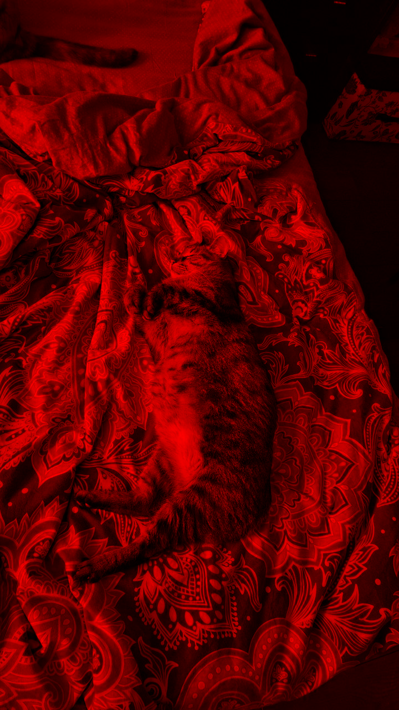
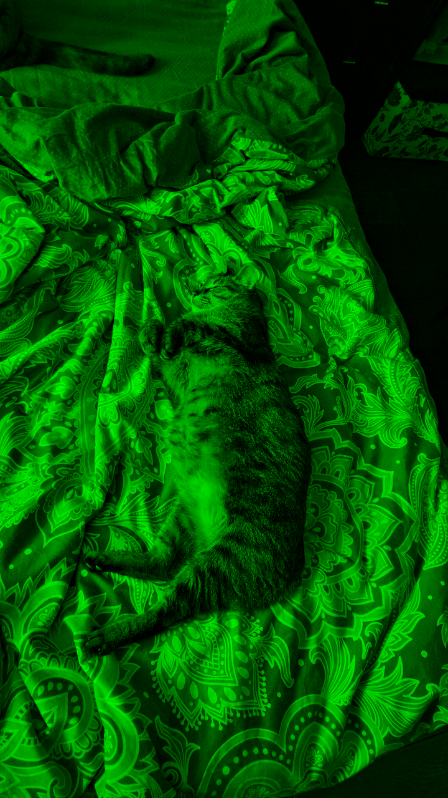
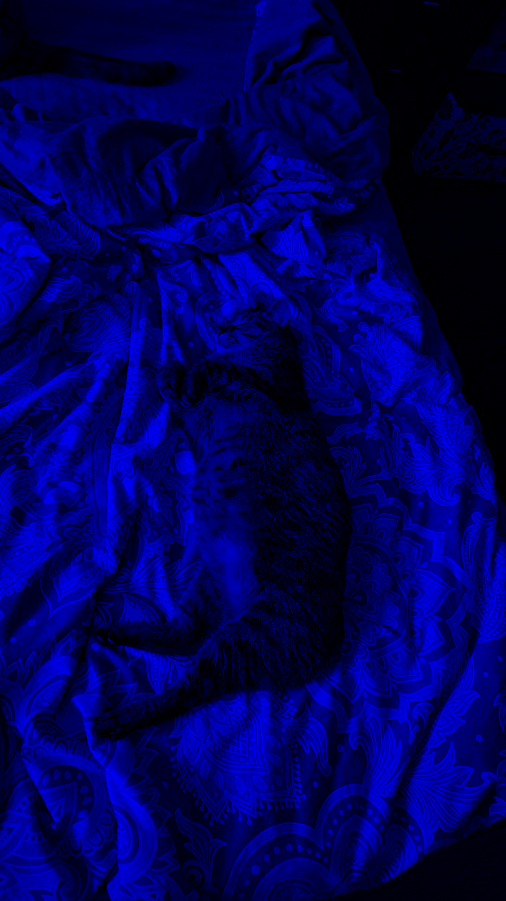

# Лабораторная работа №1
## Цветовые модели и передискретизация изображений
### 1. Цветовые модели

В качестве исходного изображения использован файл `photo.png` (размещён в папке `imgs`).

**Исходное изображение:**

#### 1.1 Выделение компонент R, G, B
| Красный канал | Зелёный канал | Синий канал |
|---------------|---------------|-------------|
|  |  |  |

#### 1.2 Преобразование в HSI и сохранение яркостной компоненты

#### 1.3 Инвертирование яркостной компоненты
Яркостная компонента была инвертирована (\(I' = 1 - I\) в нормированном диапазоне [0,1]), после чего выполнено обратное преобразование HSI → RGB. Результат:

---

### 2. Передискретизация
#### 2.1 Растяжение в \(M = 2\) раза

Метод ближайшнего соседа

#### 2.2 Сжатие в \(N = 3\) раза

Усреднение по блокам

#### 2.3 Двухпроходная передискретизация (растяжение 2×, затем сжатие 3×)

#### 2.4 Однопроходная передискретизация с коэффициентом \(K \approx 0.667\)

---

## Выводы

В ходе лабораторной работы были изучены цветовые модели RGB и HSI, реализованы преобразования между ними, а также операция инвертирования яркостной компоненты. Освоены методы передискретизации: растяжение, сжатие и комбинированное масштабирование. Все операции выполнены без использования встроенных библиотечных функций, что позволило глубже понять алгоритмы обработки изображений. Полученные результаты наглядно демонстрируют влияние выбранных методов на качество изображения при изменении разрешения.
