# Лабораторная работа №10. Обработка голоса

**Тема:** анализатор речи для распознавания телефонного номера  
**Вариант:** 3

## Цель работы

Разработать программу распознавания речи для ограниченного словаря:  
`ноль`, `один`, `два`, `три`, `четыре`, `пять`, `шесть`, `семь`, `восемь`, `девять`, `плюс`.

## Исходные данные

В качестве эталонов использовались 11 одноканальных звуковых файлов с записью цифр от 0 до 9 и слова `плюс`.

В качестве тестовой записи использовался файл `phone.wav`, содержащий запись телефонного номера.

**Истинная последовательность символов:**  
`+79151417254`

## Описание реализованного алгоритма

### 1. Загрузка и предварительная обработка аудио

Все аудиофайлы приводились к следующим условиям:
- сигнал переводился в **моно**, если исходно был стерео;
- частота дискретизации приводилась к **16000 Гц**;
- амплитуда нормировалась;
- начальные и конечные участки тишины удалялись.

### 2. Построение спектрограммы

Для записи телефонного номера была построена спектрограмма с использованием **кратковременного преобразования Фурье (STFT)** с **окном Ханна**.

Использованные параметры:
- `n_fft = 1024`
- `win_length = 800`
- `hop_length = 200`
- окно — `Hann`

Частота на спектрограмме отображалась в **логарифмической шкале**.

### 3. Сегментация записи

Для выделения отдельных слов использовалась сегментация по **энергии сигнала**:
- вычислялось RMS-значение по коротким окнам;
- участки, в которых энергия превышала заданный порог, считались активной речью;
- близкие интервалы объединялись;
- слишком короткие интервалы отбрасывались как шум или случайные всплески.

В результате запись телефонного номера была разделена на **12 сегментов**, что соответствует количеству произнесённых символов.

### 4. Извлечение признаков

Для каждого эталона и каждого сегмента вычислялись **MFCC-признаки**.

Использовалось:
- `n_mfcc = 13`

Перед сравнением коэффициенты центрировались по времени для повышения устойчивости.

### 5. Сопоставление сегмента и эталона

Для сравнения сегмента с каждым эталоном использовался алгоритм **DTW**.

Для каждого сегмента вычислялось расстояние до всех эталонов, после чего:
- выбирался эталон с минимальным расстоянием;
- сохранялись также вторая и третья гипотезы;
- вычислялась оценка достоверности.

### 6. Оценка достоверности

Оценка достоверности вычислялась по формуле:

$$
C = 1 - \frac{d_1}{d_2}
$$

где:
- $d_1$ — расстояние до лучшего эталона,
- $d_2$ — расстояние до второго по близости эталона.

## Результаты эксперимента

### Осциллограмма записи номера

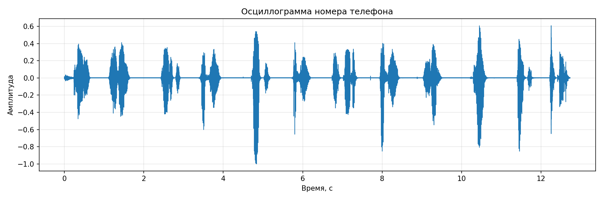

### Спектрограмма записи номера

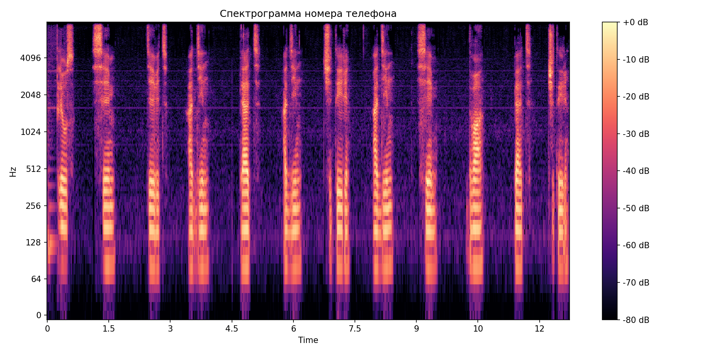

### Осцилограммы сегментов

- 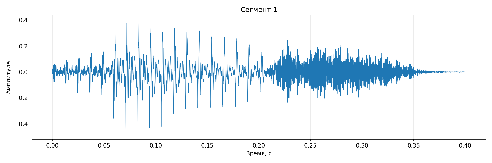
- 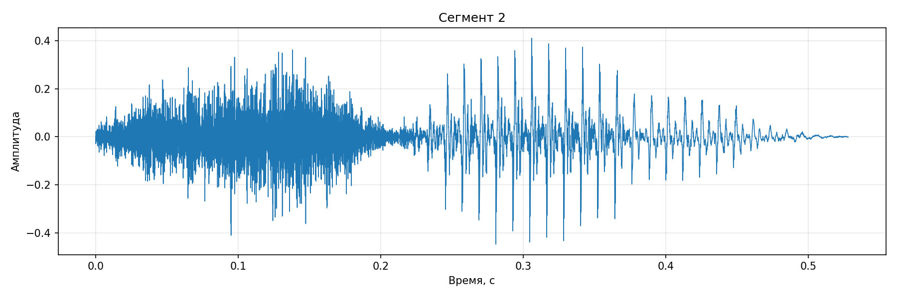
- 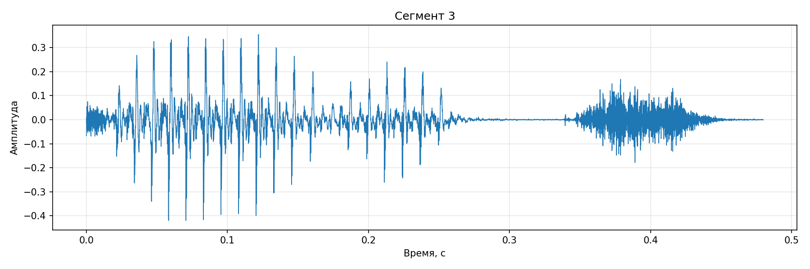
- 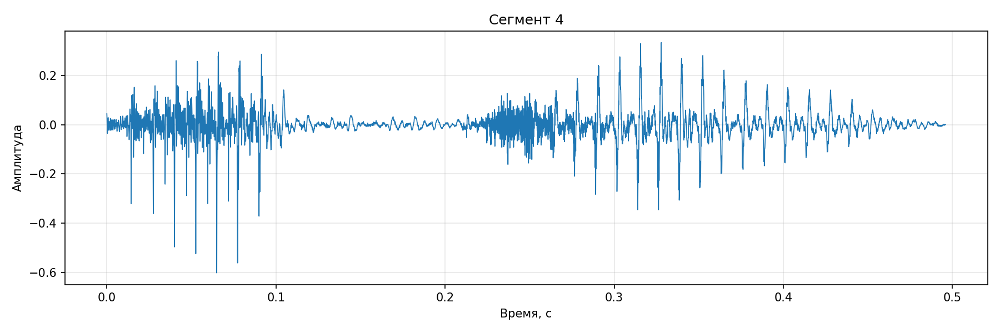
- 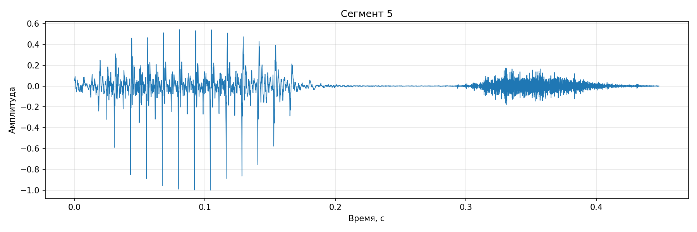
- 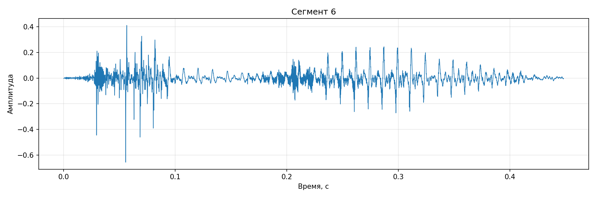
- 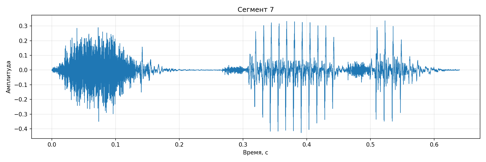
- 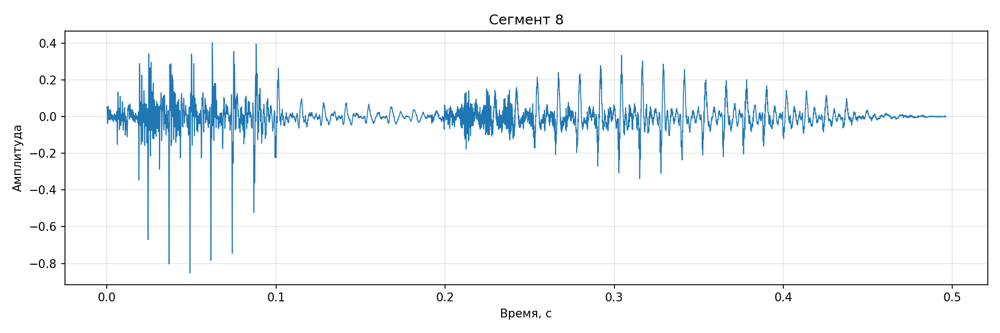
- 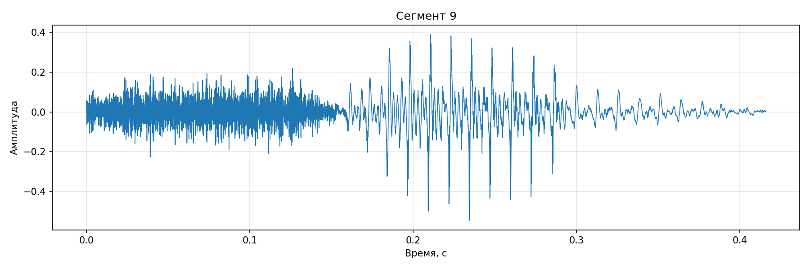
- 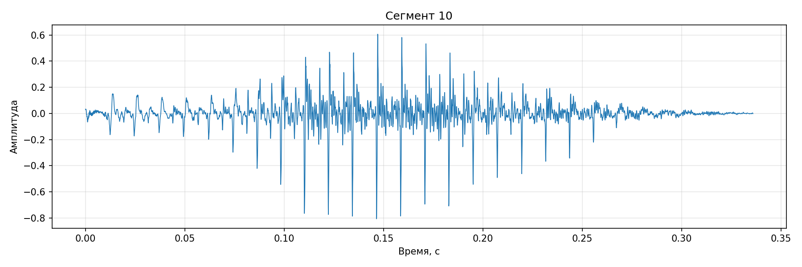
- 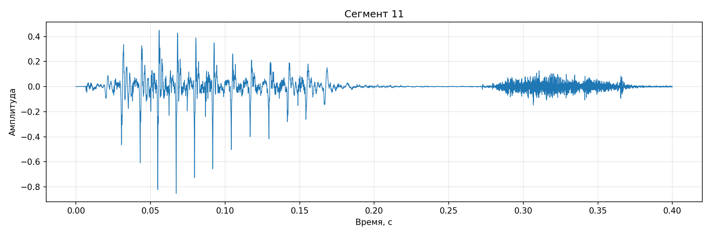
- 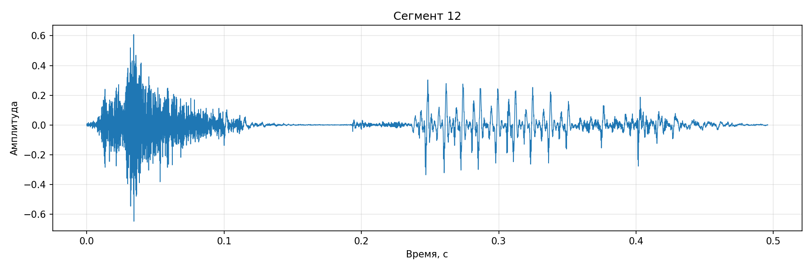

## Таблица результатов распознавания

| № сегмента | Интервал времени, с | Распознанный образец | DTW-расстояние | Достоверность | Три лучшие гипотезы(<гипотеза>: <расстояние>) |
|---|---:|---:|---:|---:|---|
| 1 | 0.272–0.672 | `+` | 44.386647 | 0.2966 | `+:44.3866, 0:63.1059, 8:68.8353` |
| 2 | 1.136–1.664 | `7` | 36.385069 | 0.4669 | `7:36.3851, 3:68.2542, 2:77.1557` |
| 3 | 2.464–2.944 | `9` | 42.127751 | 0.3267 | `9:42.1278, 5:62.5676, 0:66.1283` |
| 4 | 3.440–3.936 | `1` | 48.619135 | 0.3255 | `1:48.6191, 3:72.0787, 4:75.0853` |
| 5 | 4.736–5.184 | `5` | 43.742981 | 0.1493 | `5:43.7430, 9:51.4204, 0:75.0173` |
| 6 | 5.744–6.192 | `1` | 45.963057 | 0.2985 | `1:45.9631, 3:65.5203, 0:75.5383` |
| 7 | 6.752–7.392 | `4` | 55.673151 | 0.1985 | `4:55.6732, 7:69.4572, 3:70.7067` |
| 8 | 7.952–8.448 | `1` | 49.087402 | 0.2761 | `1:49.0874, 3:67.8057, 8:71.6168` |
| 9 | 9.072–9.488 | `7` | 44.447182 | 0.3066 | `7:44.4472, 3:64.1028, 2:72.3675` |
| 10 | 10.304–10.640 | `0` | 45.544080 | 0.0485 | `0:45.5441, 2:47.8636, 3:57.5207` |
| 11 | 11.392–11.792 | `5` | 51.223246 | 0.0596 | `5:51.2232, 9:54.4703, 0:63.4242` |
| 12 | 12.224–12.720 | `4` | 50.662934 | 0.2683 | `4:50.6629, 7:69.2381, 3:75.6488` |

## Итоговый результат распознавания

**Распознанная цепочка:**  
`+79151417054`

**Истинная цепочка:**  
`+79151417254`

### Число ошибок

Для оценки качества распознавания использовалось расстояние Левенштейна.

**Количество ошибок:** `1`

### Оценка достоверности

**Средняя достоверность:** `0.2517`

Среднее значение оказалось сравнительно невысоким, что говорит о том, что многие сегменты были распознаны с небольшой разницей между первой и второй гипотезами, хотя и итоговый результат оказался хорошим.

Можно отметить 10ый сегмент, для которого достоверность составила всего `0.0485`. Это значит, что лучшая и вторая гипотезы были почти равноправны, что и привело к ошибке распознавания.
