# Лабораторная работа №2
## Обесцвечивание и бинаризация растровых изображений

**Вариант:** 8

---

## Результаты обработки

### 1. Сравнение исходных цветных и полутоновых изображений

Для каждого примера слева показано исходное цветное изображение, справа — полученное полутоновое изображение.

Для каждого исходного цветного изображения выполнялось взвешенное усреднение каналов:

$$
Y = 0.299 \cdot R + 0.587 \cdot G + 0.114 \cdot B
$$

| **Мультфильм** | |
|:---:|:---:|
| 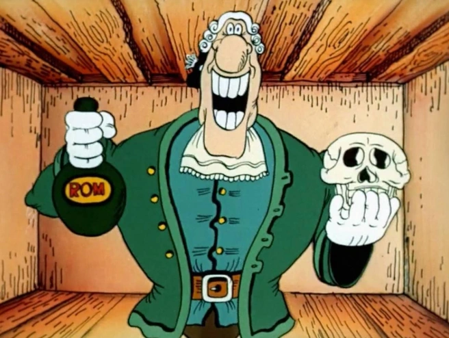 | 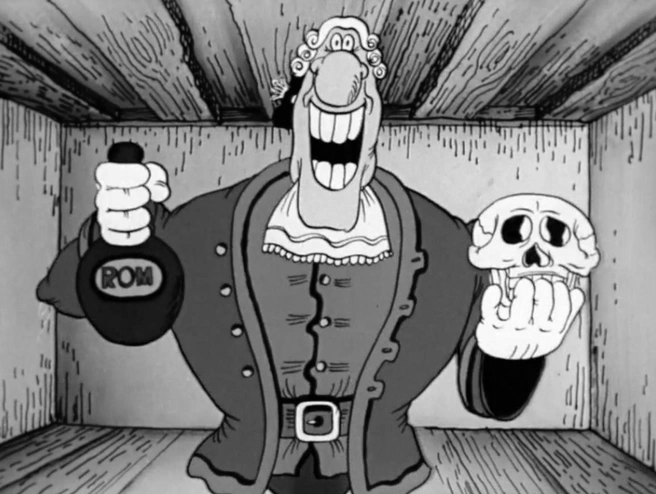 |

| **Рентгеновский снимок** | |
|:---:|:---:|
| 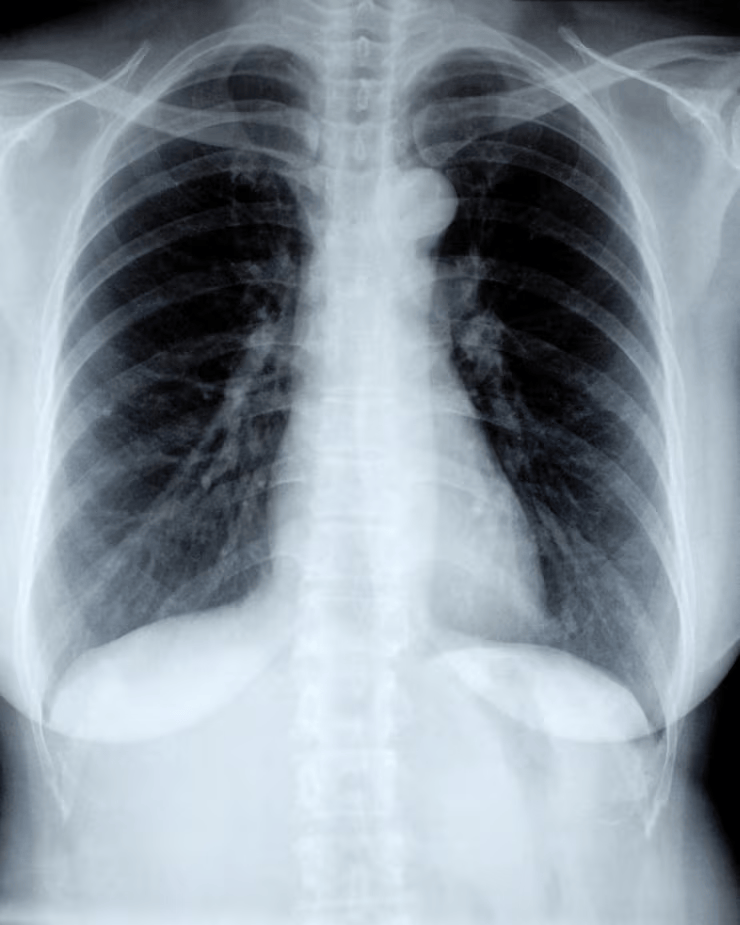 | 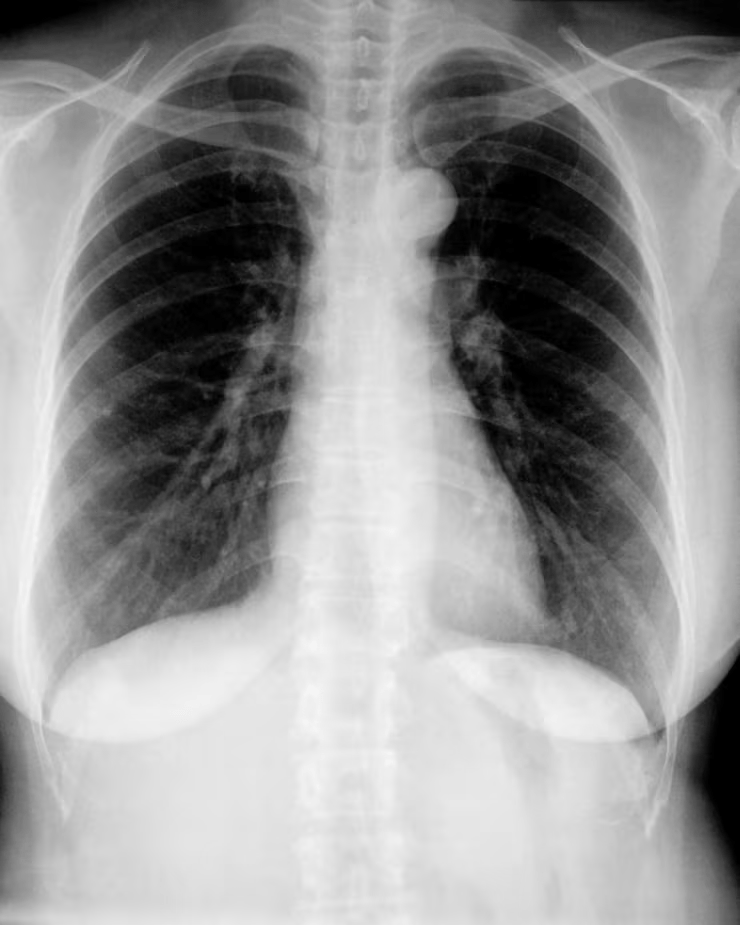 |

| **Контурная карта** | |
|:---:|:---:|
| 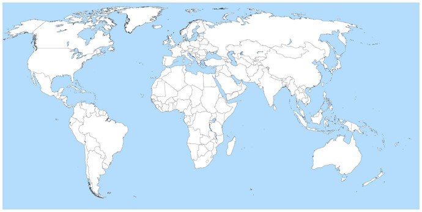 |  |

| **Текст 1** | |
|:---:|:---:|
| 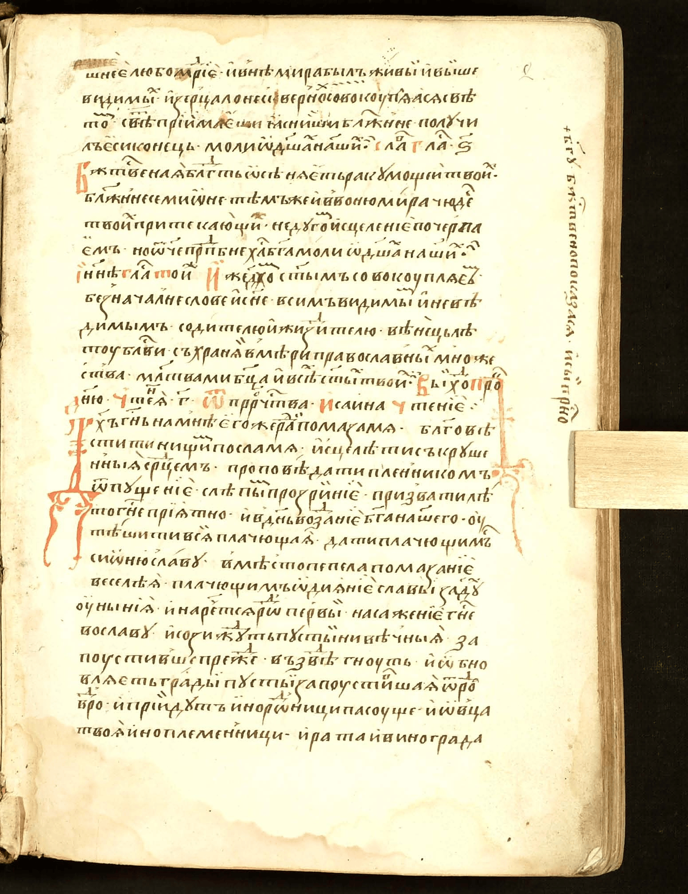 | 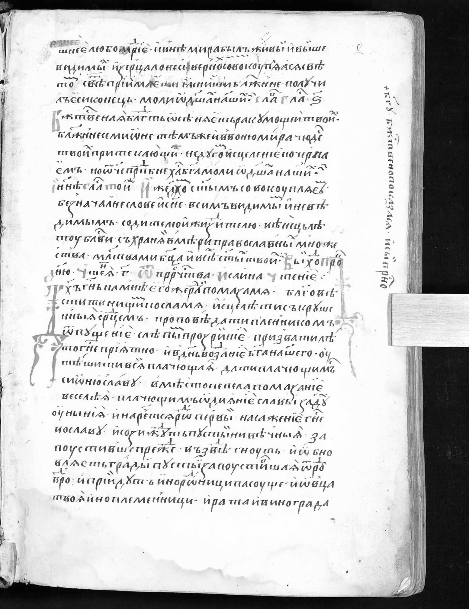 |

| **Текст 2** | |
|:---:|:---:|
|  |  |

---

### 2. Бинаризация изображений методом WAN

Для бинаризации использовался метод WAN с окном $3 \times 3$.

Порог вычисляется по формуле:

$$
T(x,y) = m(x,y)\left(1 - k\left(1 - \frac{s(x,y)}{R_{max}}\right)\right)
$$

где:
- $m(x,y)$ — локальное среднее,
- $s(x,y)$ — локальное среднеквадратичное отклонение,
- $k = 0.2$,
- $R_{max}$ — параметр метода.

---

### 2.2. Эксперимент с параметром $R_{max}$ для `xray`

Для текстового изображения `xray` были рассмотрены несколько значений параметра $R_{max}$:
- $R_{max} = 1$
- $R_{max} = 5$
- $R_{max} = 10$

#### Исходное полутоновое изображение

#### Результаты бинаризации

| $R_{max} = 10$ |  
|:---:|
| 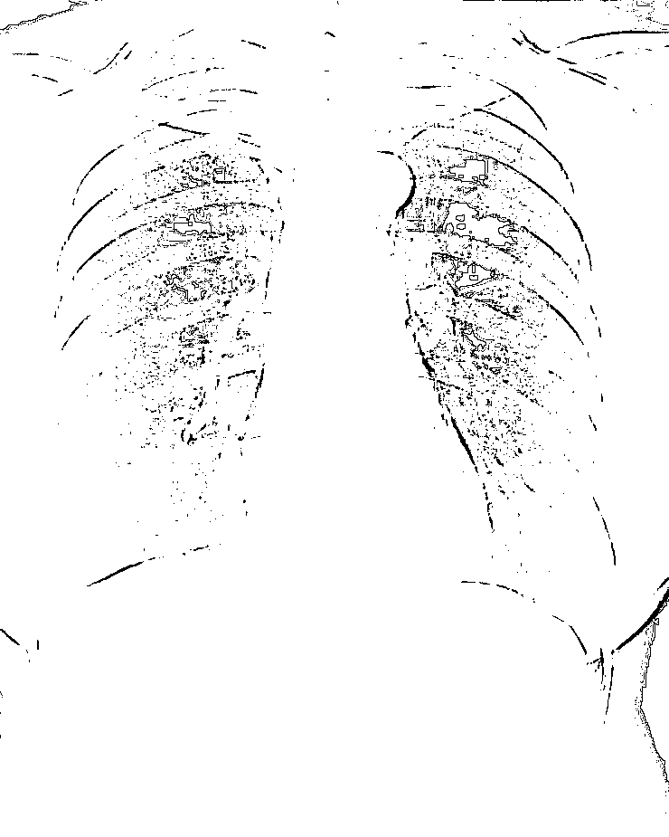 | 
$R_{max} = 5$ |
| 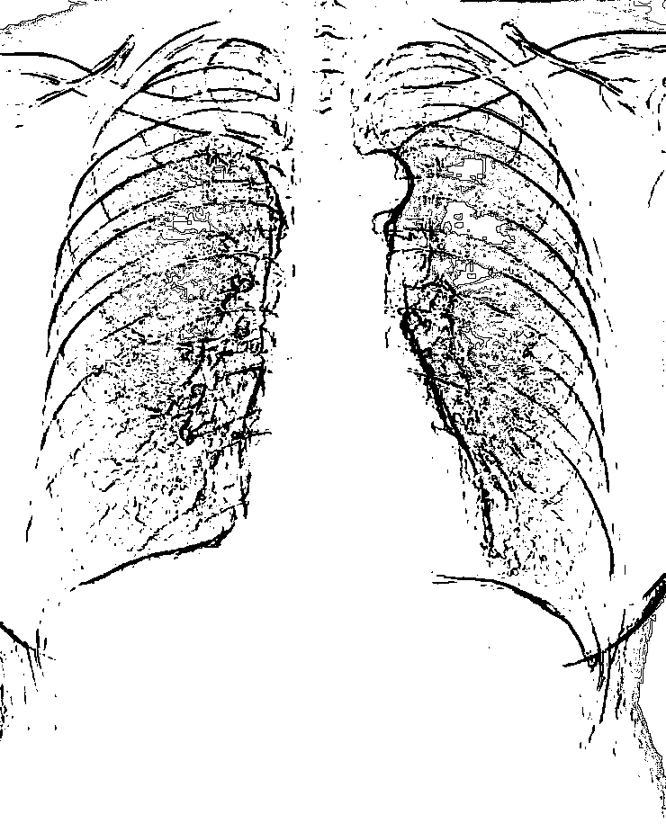 | 
$R_{max} = 1$ |
| 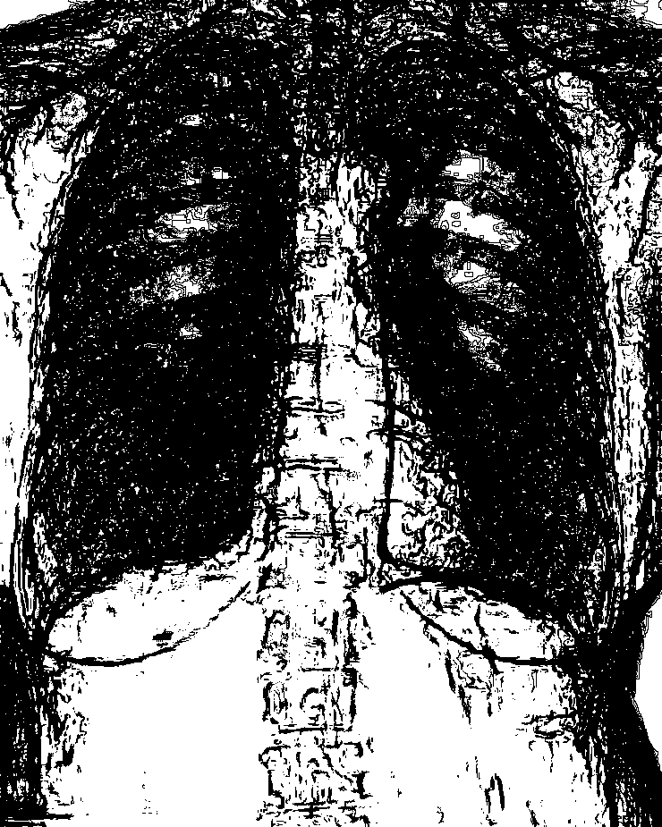 | 

Вывод:
Скорее всего метод не подходит для данного изображения, так как при значении $R_{max} = 10$ нету почти всего изображения, при значении 5, может по лучше, но все равно большая часть изображения стерлась, а при значении 1 просто страшная картина.
---

### 2.2. Эксперимент с параметром $R_{max}$ для `cartoon`

Для текстового изображения `cartoon` были рассмотрены несколько значений параметра $R_{max}$:
- $R_{max} = 40$
- $R_{max} = 60$

#### Исходное полутоновое изображение

#### Результаты бинаризации

| $R_{max} = 40$ |  
|:---:|
| 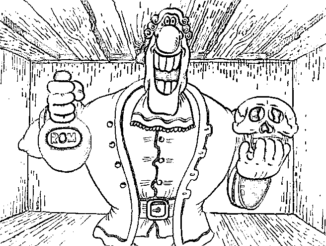 | 
$R_{max} = 60$ |
|  | 

Вывод: 
Оптимальным значением $R_{max}$ для cartoon изображение можно взять либо 40, либо 60, в зависимости от того, что больше нравится - толстые контуры или тонкие.
---

### 2.2. Эксперимент с параметром $R_{max}$ для `map`

Для текстового изображения `map` были рассмотрены несколько значений параметра $R_{max}$:
- $R_{max} = 10$
- $R_{max} = 15$
- $R_{max} = 20$

#### Исходное полутоновое изображение

#### Результаты бинаризации

| $R_{max} = 10$ |  
|:---:|
| 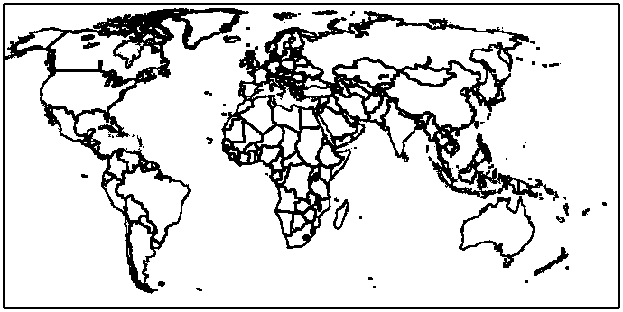 | 
$R_{max} = 20$ |
| 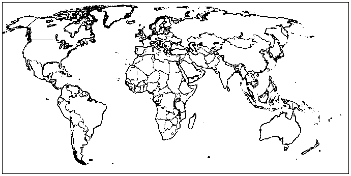 | 
$R_{max} = 30$ |
| 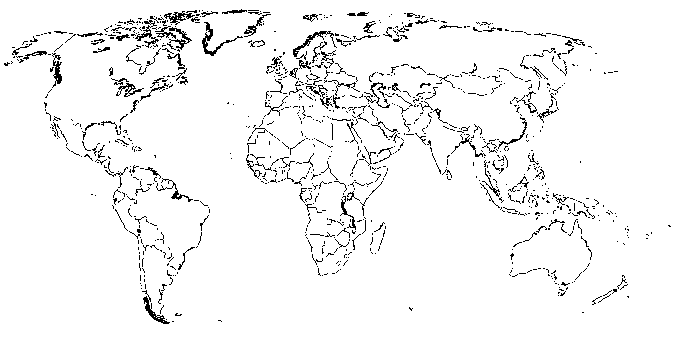 | 

Вывод: 
Оптимальным значением $R_{max}$ для map изображение можно взять значение 20, так как при меньшем значении границы становятся слишком жирными, а при большем значении начинают стираться в нужных местах.
---

### 2.2. Эксперимент с параметром $R_{max}$ для `text1`

Для текстового изображения `text1` были рассмотрены несколько значений параметра $R_{max}$:
- $R_{max} = 10$
- $R_{max} = 15$
- $R_{max} = 20$

#### Исходное полутоновое изображение

#### Результаты бинаризации

| $R_{max} = 10$ |  
|:---:|
| 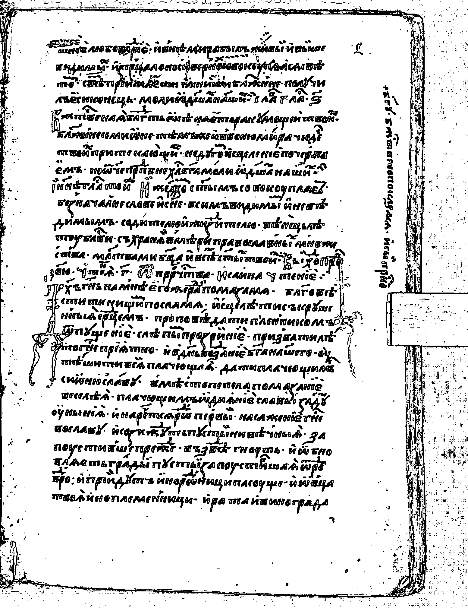 | 
$R_{max} = 15$ |
 | 
$R_{max} = 20$ |
 |

Вывод: 
Оптимальным значением $R_{max}$ для text1 изображение можно взять значение 20, так как при меньшем значении буквы начинают сливаться, а при большем значение большие буквы (как на 5-ой и 8-ой строчках) будут не читабельными.

---

### 2.3. Эксперимент с параметром $R_{max}$ для `text2`

Для текстового изображения `text2` были рассмотрены несколько значений параметра $R_{max}$:
- $R_{max} = 10$
- $R_{max} = 15$
- $R_{max} = 20$

#### Исходное полутоновое изображение

#### Результаты бинаризации

| $R_{max} = 10$ |  
|:---:|
| 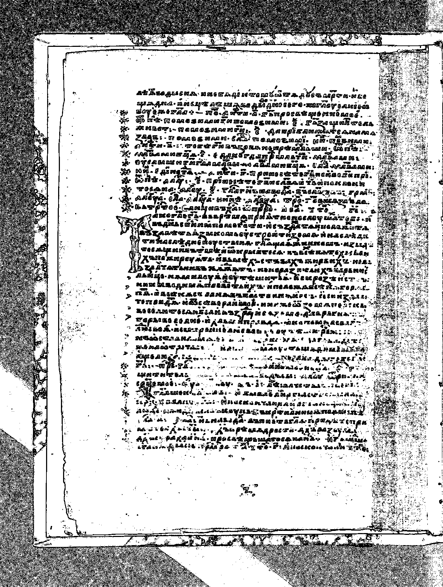 | 
$R_{max} = 15$ |
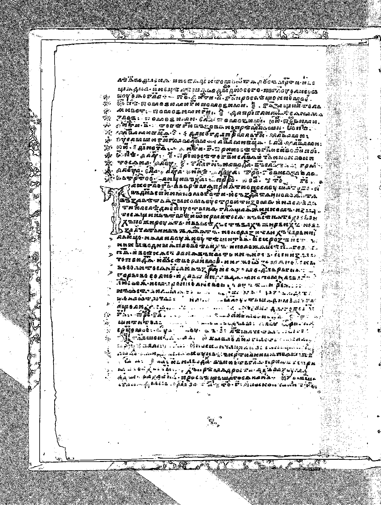 |
$R_{max} = 20$ |
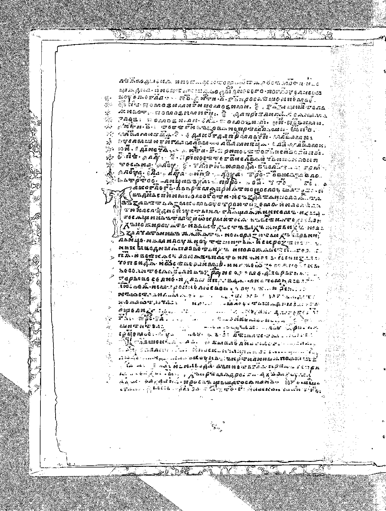 |

Вывод: 
Для text2 изображение скорее всего данный метод бинаризации не подходит, так как при значении $R_{max} = 20$ многие буквы стираются, как и при значении 15, а при значении 10 буквы перестают быть читабельными. 
