# Лабораторная работа №2
## Обесцвечивание и бинаризация растровых изображений

**Вариант:** 8  

---

## Результаты обработки

### 1. Сравнение исходных цветных и полутоновых изображений

Для каждого примера слева показано исходное цветное изображение, справа – полученное полутоновое.

Для каждого исходного цветного изображения выполнялось взвешенное усреднение каналов:

$$Y = 0.299 \cdot R + 0.587 \cdot G + 0.114 \cdot B$$

| **Мультфильм** | |
|:---:|:---:|
| 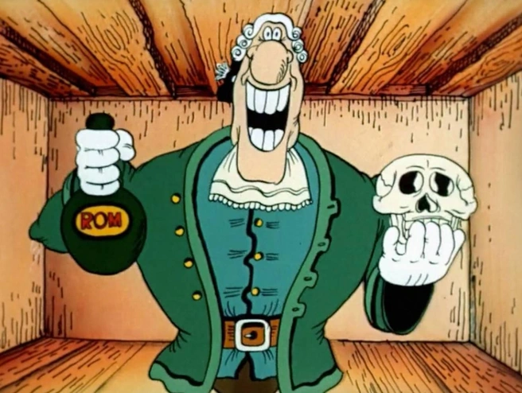 |  |

| **Рентгеновский снимок** | |
|:---:|:---:|
|  |  |

| **Контурная карта** | |
|:---:|:---:|
| 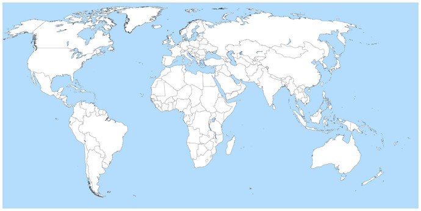 | 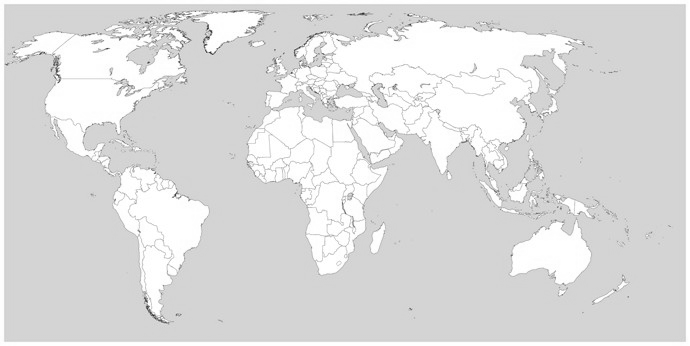 |

| **Текст (равномерный фон)** | |
|:---:|:---:|
|  | 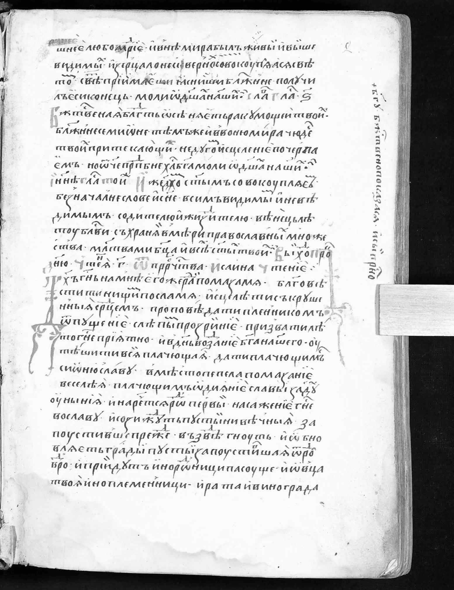 |

| **Текст с неравномерной засветкой** | |
|:---:|:---:|
| 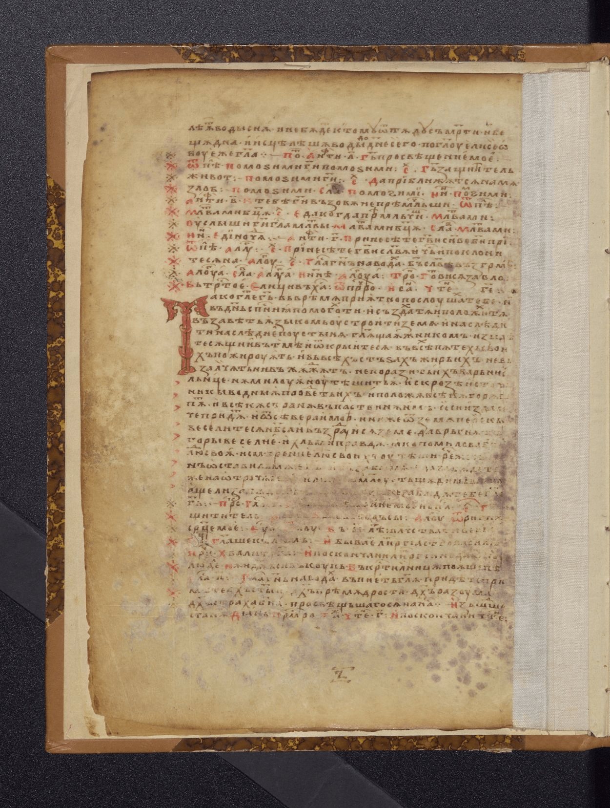 | 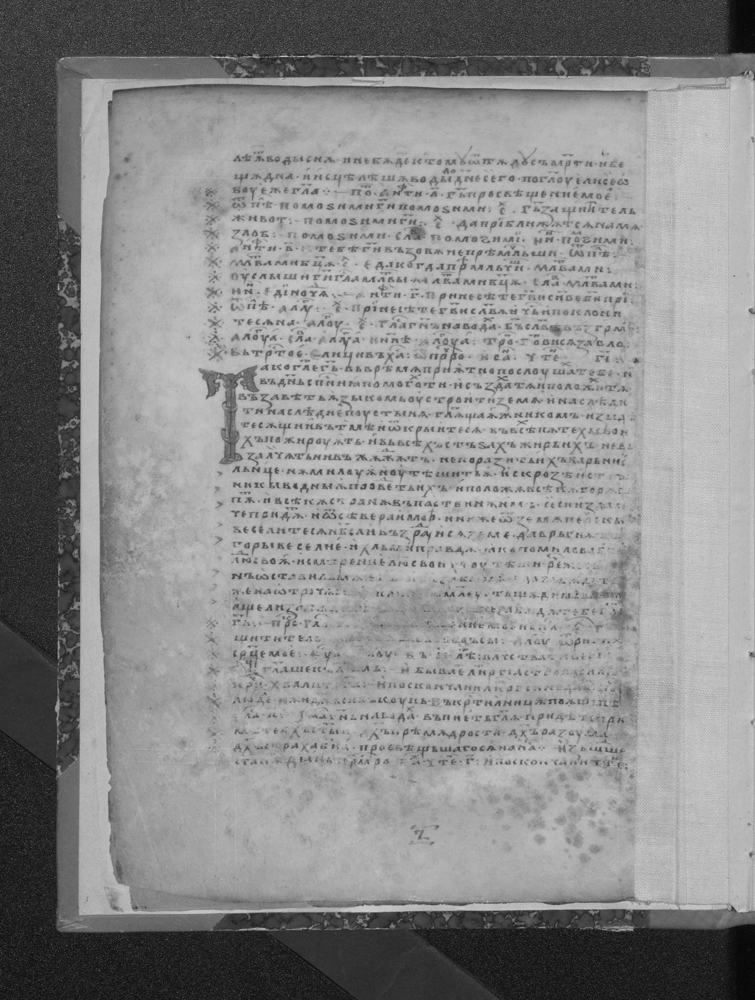 |

| **Дополнительный пример текста** | |
|:---:|:---:|
| 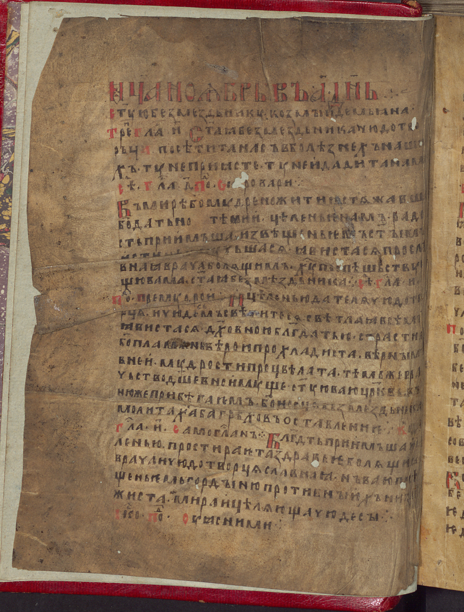 |  |

---

### 2. Сравнение полутоновых и бинаризованных (метод WAN) изображений

Для каждого примера слева приведено полутоновое изображение, справа – результат адаптивной бинаризации методом WAN.

Порог вычисляется по формуле:

$$T_{Singh} = m(x,y) \left( 1 - k \left( \frac{s(x,y)}{1-\delta} - 1 \right) \right)$$

| **Мультфильм** | |
|:---:|:---:|
|  | 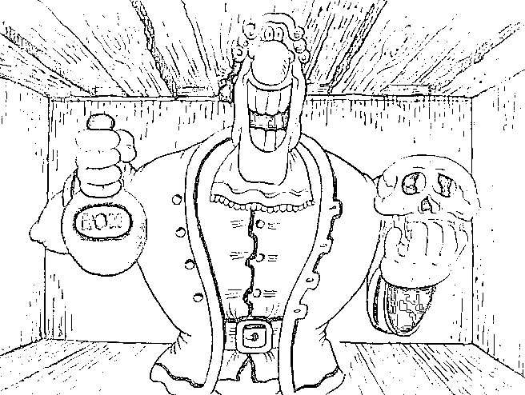 |

| **Рентгеновский снимок** | |
|:---:|:---:|
|  | 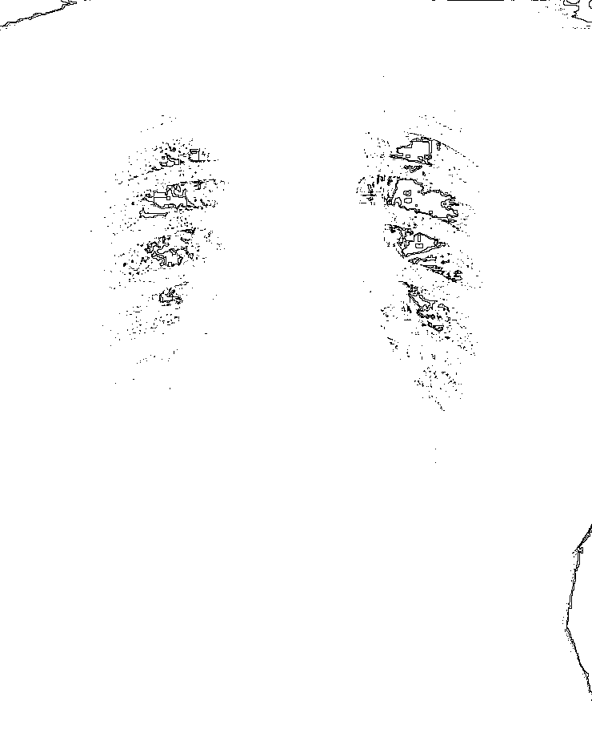 |

| **Контурная карта** | |
|:---:|:---:|
|  | 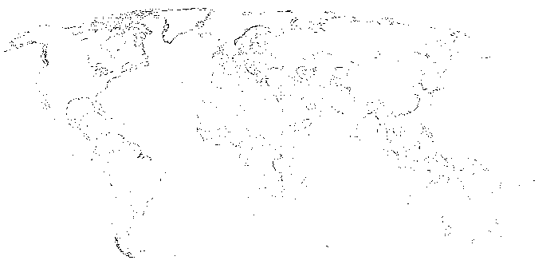 |

| **Текст (равномерный фон)** | |
|:---:|:---:|
|  | 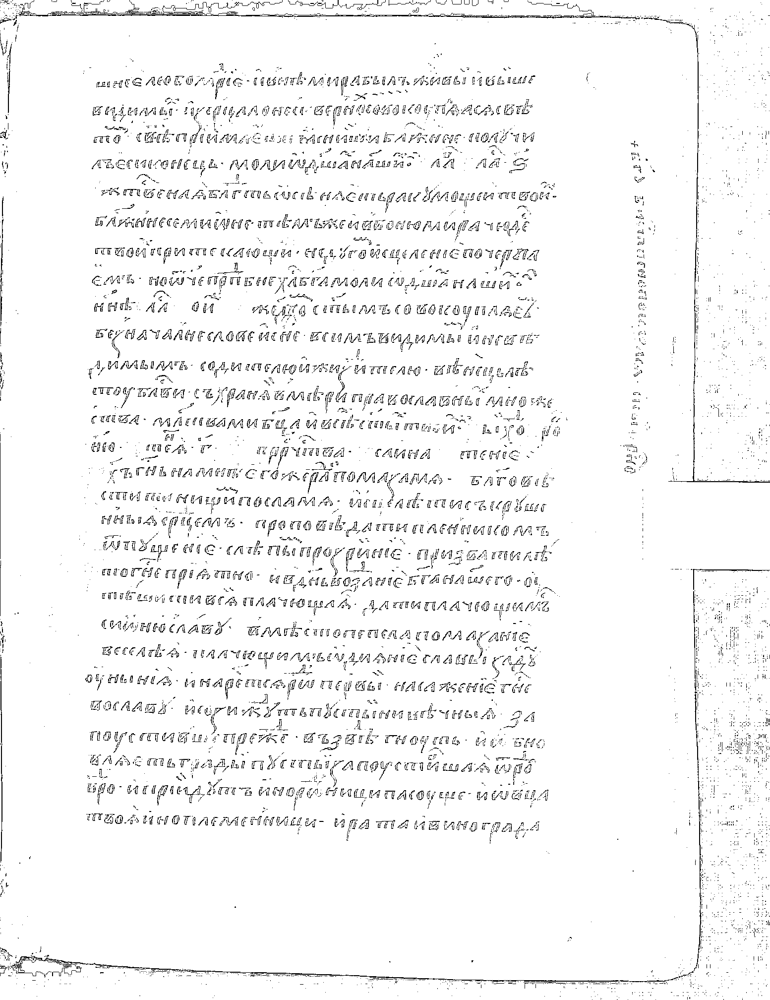 |

| **Текст с неравномерной засветкой** | |
|:---:|:---:|
|  | 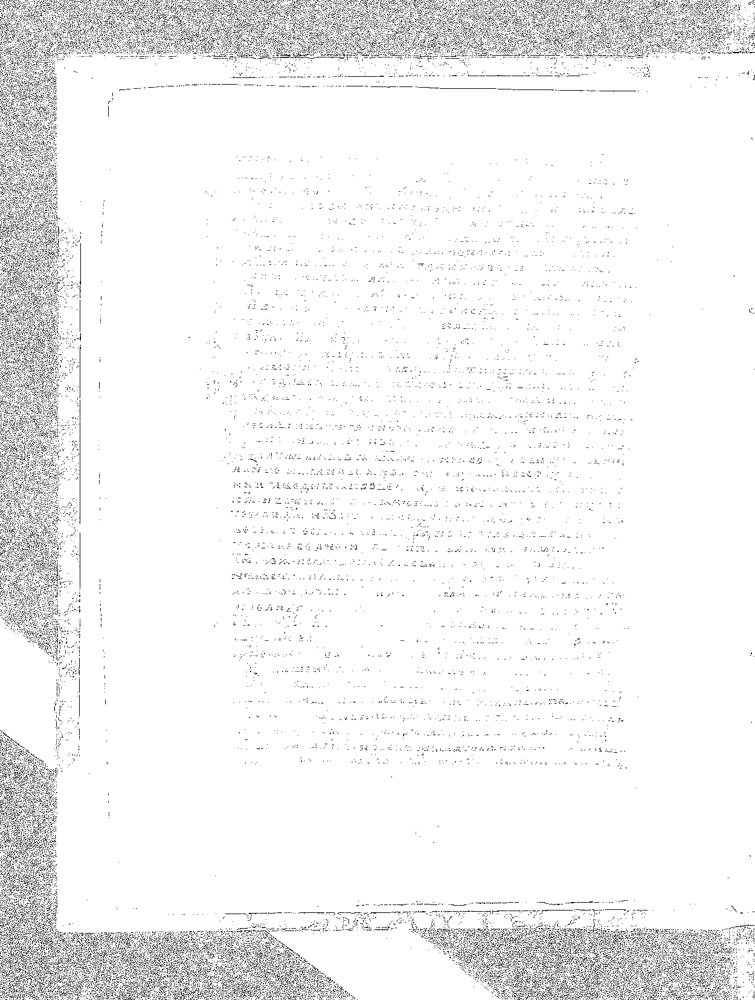 |

| **Дополнительный пример текста** | |
|:---:|:---:|
|  | 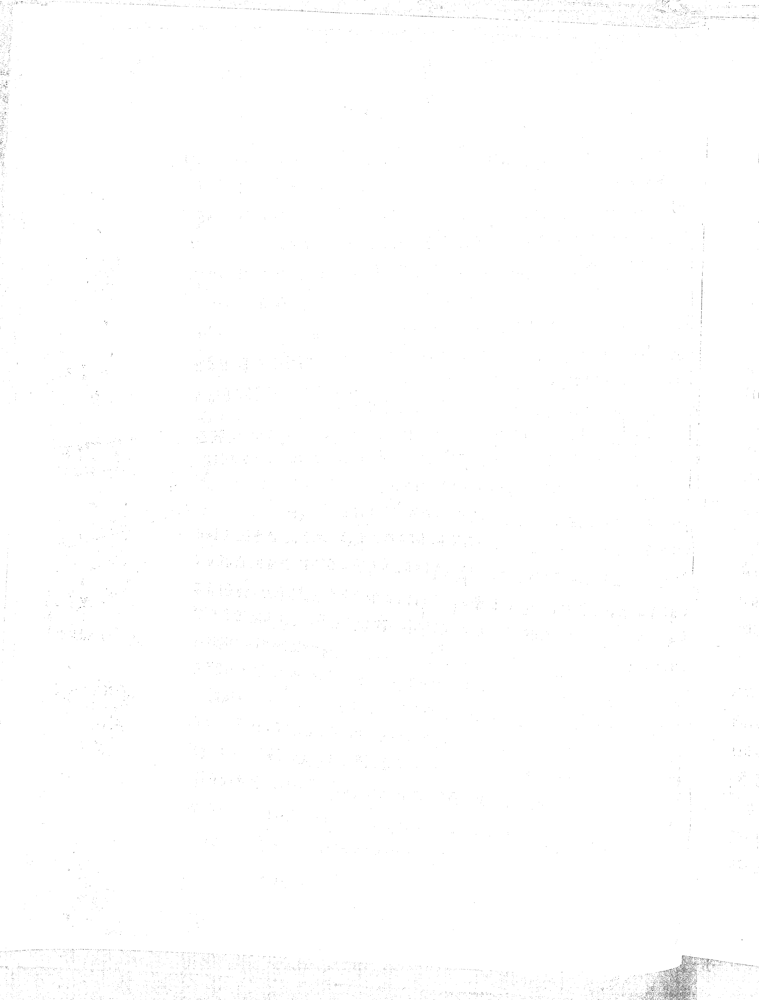 |

