# Лабораторная работа №5. Выделение признаков символов

**Вариант:** 8  
**Алфавит:** Османья  
**Символы алфавита:** 𐒀 𐒁 𐒂 𐒃 𐒄 𐒅 𐒆 𐒇 𐒈 𐒉 𐒊 𐒋 𐒌 𐒍 𐒎 𐒏 𐒐 𐒑 𐒒 𐒓 𐒔 𐒕 𐒖 𐒗 𐒘 𐒙 𐒚 𐒛 𐒜 𐒝  
**Кегль:** 52  

Скалярные характеристики символов автоматически получены программой и экспортированы из файла `skalar.csv`.  
Изображения символов берутся из папки `symbols`, графики профилей — из папки `profiles`.

---

## Символ 1 — 𐒀

### Изображение символа

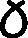

### Скалярные характеристики

| Признак | Значение |
|---|---:|
| Ширина изображения | 28 |
| Высота изображения | 38 |
| Общий вес чёрного | 469 |
| Общий удельный вес | 0.440789 |
| Вес 1-й четверти | 102 |
| Вес 2-й четверти | 126 |
| Вес 3-й четверти | 126 |
| Вес 4-й четверти | 115 |
| Удельный вес 1-й четверти | 0.383459 |
| Удельный вес 2-й четверти | 0.473684 |
| Удельный вес 3-й четверти | 0.473684 |
| Удельный вес 4-й четверти | 0.432331 |
| Координата центра тяжести X | 13.814499 |
| Координата центра тяжести Y | 19.249467 |
| Нормированная координата X | 0.511648 |
| Нормированная координата Y | 0.520256 |
| Осевой момент инерции Ix | 59319.812367 |
| Осевой момент инерции Iy | 29804.861407 |
| Нормированный момент инерции Ix | 0.052398 |
| Нормированный момент инерции Iy | 0.026327 |

### Профиль X

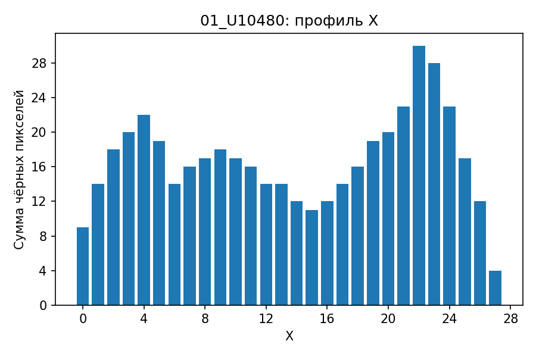

### Профиль Y

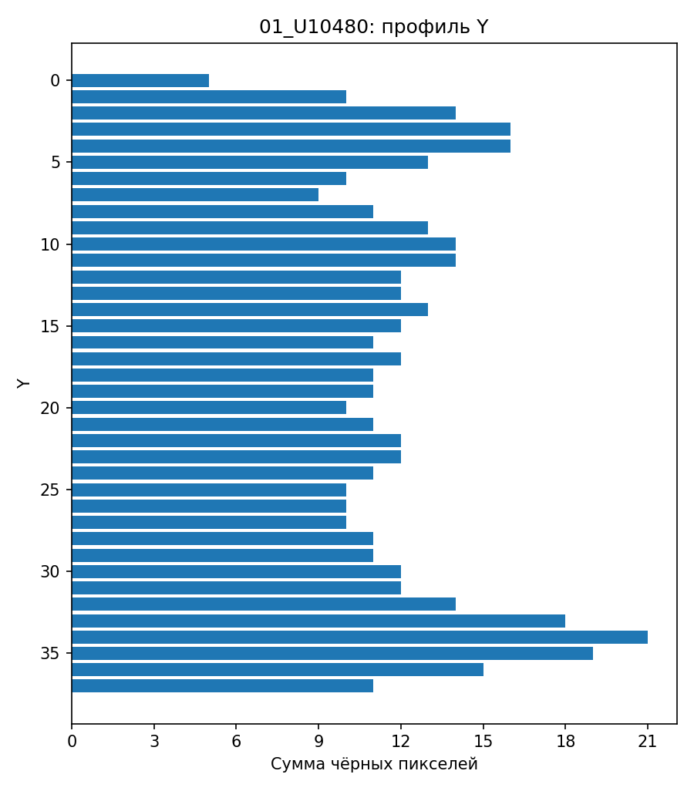

---
## Символ 2 — 𐒁

### Изображение символа

### Скалярные характеристики

| Признак | Значение |
|---|---:|
| Ширина изображения | 34 |
| Высота изображения | 38 |
| Общий вес чёрного | 636 |
| Общий удельный вес | 0.492260 |
| Вес 1-й четверти | 190 |
| Вес 2-й четверти | 149 |
| Вес 3-й четверти | 152 |
| Вес 4-й четверти | 145 |
| Удельный вес 1-й четверти | 0.588235 |
| Удельный вес 2-й четверти | 0.461300 |
| Удельный вес 3-й четверти | 0.470588 |
| Удельный вес 4-й четверти | 0.448916 |
| Координата центра тяжести X | 15.438679 |
| Координата центра тяжести Y | 18.117925 |
| Нормированная координата X | 0.467839 |
| Нормированная координата Y | 0.489674 |
| Осевой момент инерции Ix | 71248.155660 |
| Осевой момент инерции Iy | 52712.608491 |
| Нормированный момент инерции Ix | 0.042682 |
| Нормированный момент инерции Iy | 0.031578 |

### Профиль X

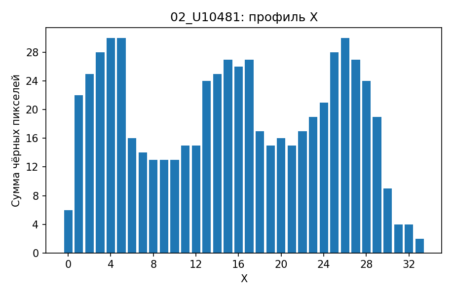

### Профиль Y

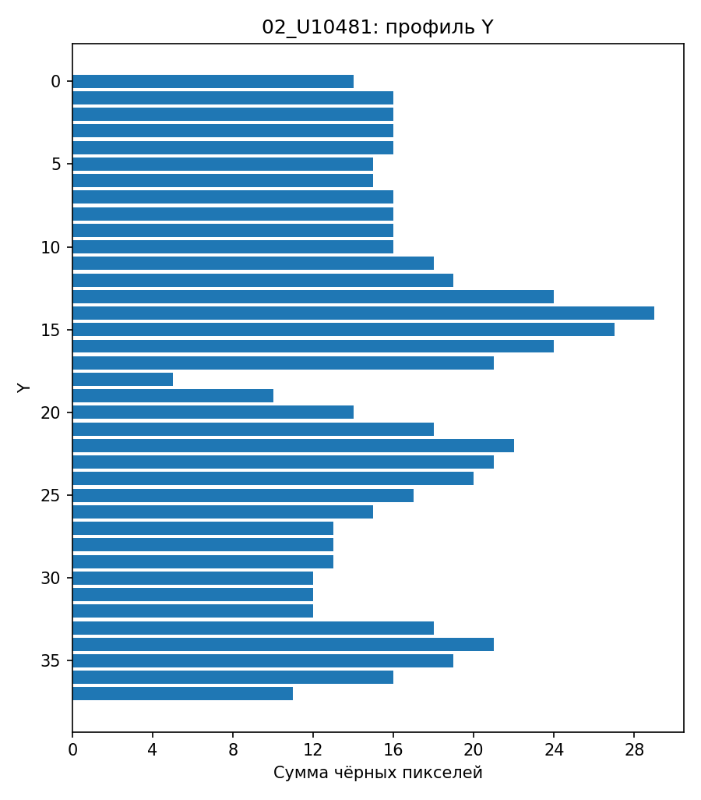

---
## Символ 3 — 𐒂

### Изображение символа

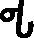

### Скалярные характеристики

| Признак | Значение |
|---|---:|
| Ширина изображения | 34 |
| Высота изображения | 38 |
| Общий вес чёрного | 463 |
| Общий удельный вес | 0.358359 |
| Вес 1-й четверти | 133 |
| Вес 2-й четверти | 104 |
| Вес 3-й четверти | 41 |
| Вес 4-й четверти | 185 |
| Удельный вес 1-й четверти | 0.411765 |
| Удельный вес 2-й четверти | 0.321981 |
| Удельный вес 3-й четверти | 0.126935 |
| Удельный вес 4-й четверти | 0.572755 |
| Координата центра тяжести X | 17.205184 |
| Координата центра тяжести Y | 19.207343 |
| Нормированная координата X | 0.521369 |
| Нормированная координата Y | 0.519117 |
| Осевой момент инерции Ix | 43976.095032 |
| Осевой момент инерции Iy | 32949.507559 |
| Нормированный момент инерции Ix | 0.026345 |
| Нормированный момент инерции Iy | 0.019739 |

### Профиль X

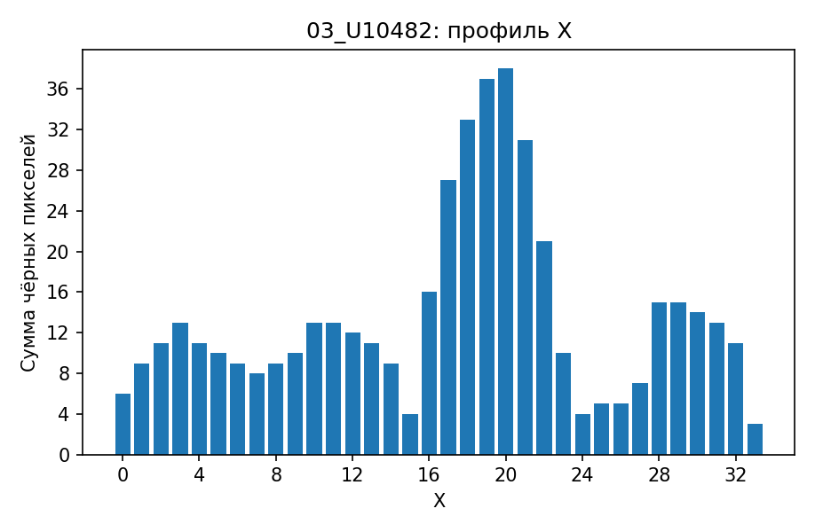

### Профиль Y

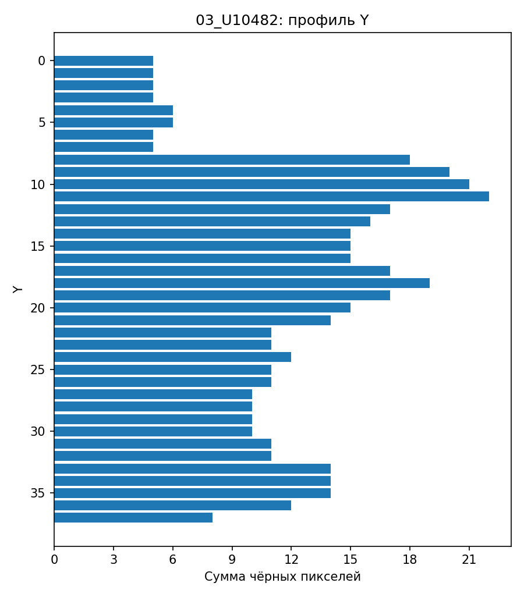

---
## Символ 4 — 𐒃

### Изображение символа

### Скалярные характеристики

| Признак | Значение |
|---|---:|
| Ширина изображения | 9 |
| Высота изображения | 37 |
| Общий вес чёрного | 194 |
| Общий удельный вес | 0.582583 |
| Вес 1-й четверти | 14 |
| Вес 2-й четверти | 80 |
| Вес 3-й четверти | 52 |
| Вес 4-й четверти | 48 |
| Удельный вес 1-й четверти | 0.194444 |
| Удельный вес 2-й четверти | 0.888889 |
| Удельный вес 3-й четверти | 0.684211 |
| Удельный вес 4-й четверти | 0.505263 |
| Координата центра тяжести X | 4.319588 |
| Координата центра тяжести Y | 18.170103 |
| Нормированная координата X | 0.539948 |
| Нормированная координата Y | 0.504725 |
| Осевой момент инерции Ix | 22161.386598 |
| Осевой момент инерции Iy | 674.185567 |
| Нормированный момент инерции Ix | 0.199852 |
| Нормированный момент инерции Iy | 0.006080 |

### Профиль X

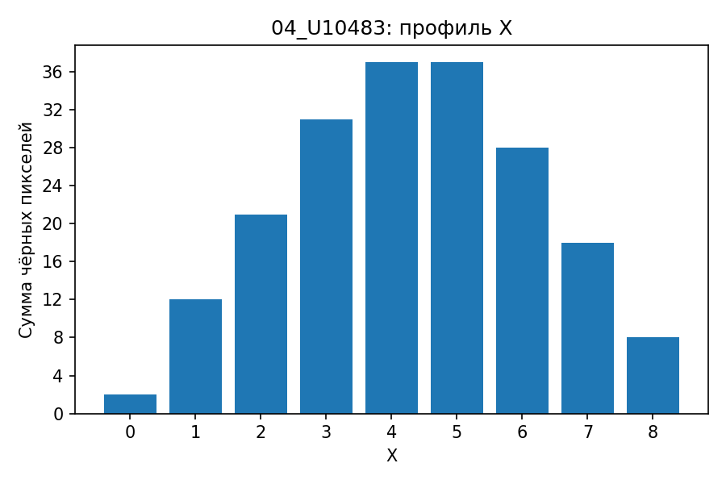

### Профиль Y

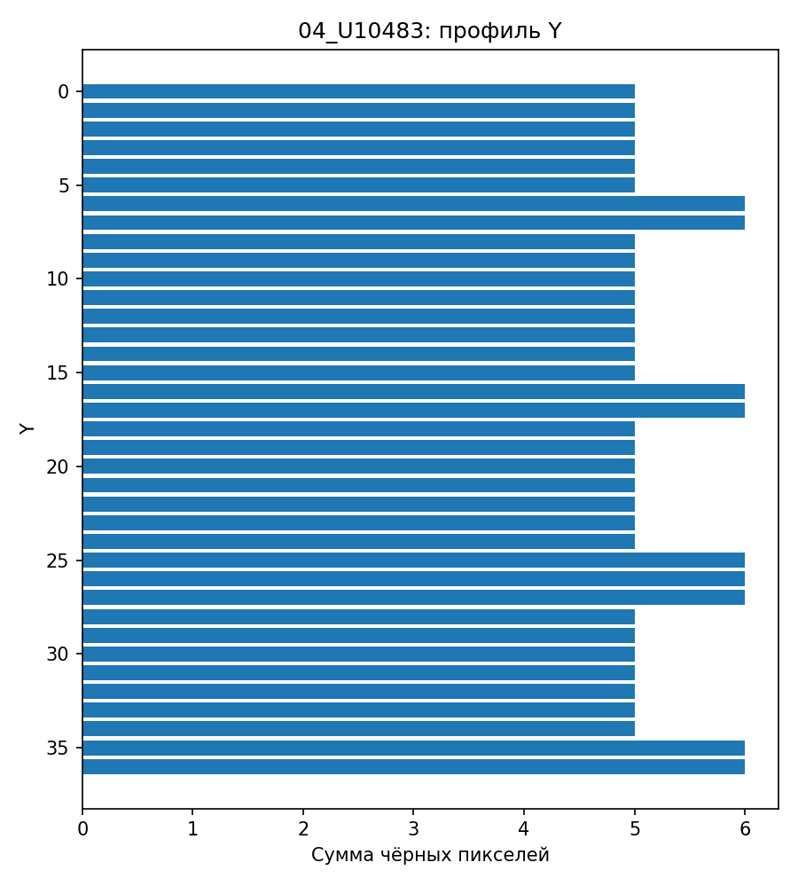

---
## Символ 5 — 𐒄

### Изображение символа

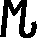

### Скалярные характеристики

| Признак | Значение |
|---|---:|
| Ширина изображения | 37 |
| Высота изображения | 38 |
| Общий вес чёрного | 593 |
| Общий удельный вес | 0.421764 |
| Вес 1-й четверти | 178 |
| Вес 2-й четверти | 124 |
| Вес 3-й четверти | 95 |
| Вес 4-й четверти | 196 |
| Удельный вес 1-й четверти | 0.520468 |
| Удельный вес 2-й четверти | 0.343490 |
| Удельный вес 3-й четверти | 0.277778 |
| Удельный вес 4-й четверти | 0.542936 |
| Координата центра тяжести X | 16.600337 |
| Координата центра тяжести Y | 18.330523 |
| Нормированная координата X | 0.461120 |
| Нормированная координата Y | 0.495420 |
| Осевой момент инерции Ix | 74937.217538 |
| Осевой момент инерции Iy | 62180.279933 |
| Нормированный момент инерции Ix | 0.037908 |
| Нормированный момент инерции Iy | 0.031454 |

### Профиль X

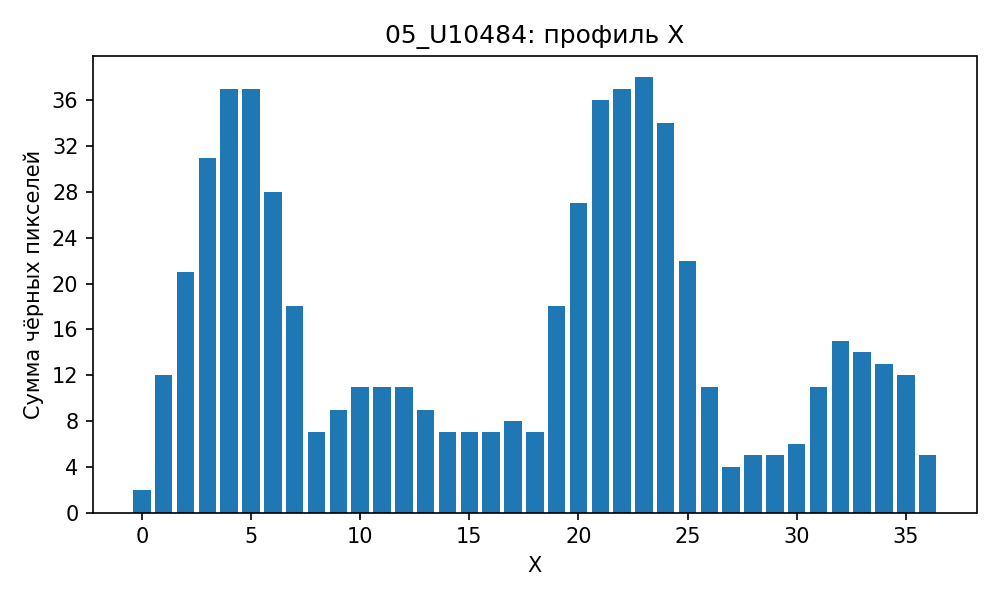

### Профиль Y

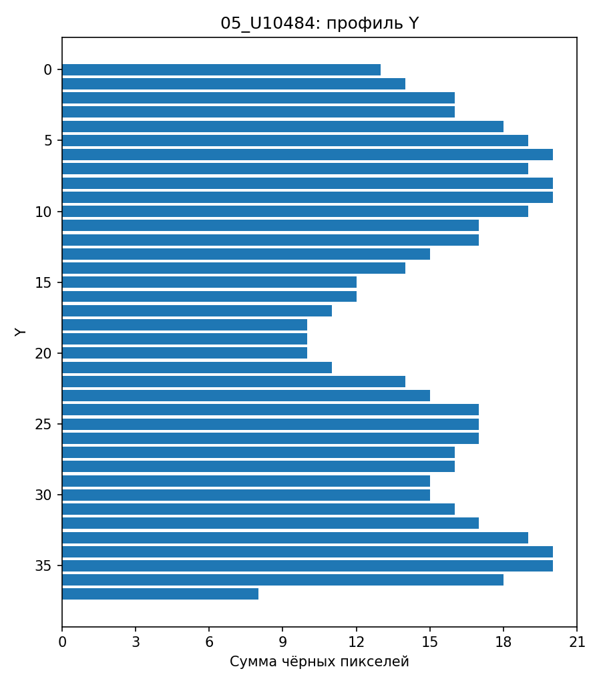

---
## Символ 6 — 𐒅

### Изображение символа

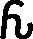

### Скалярные характеристики

| Признак | Значение |
|---|---:|
| Ширина изображения | 33 |
| Высота изображения | 39 |
| Общий вес чёрного | 517 |
| Общий удельный вес | 0.401709 |
| Вес 1-й четверти | 156 |
| Вес 2-й четверти | 55 |
| Вес 3-й четверти | 116 |
| Вес 4-й четверти | 190 |
| Удельный вес 1-й четверти | 0.513158 |
| Удельный вес 2-й четверти | 0.170279 |
| Удельный вес 3-й четверти | 0.362500 |
| Удельный вес 4-й четверти | 0.558824 |
| Координата центра тяжести X | 13.943907 |
| Координата центра тяжести Y | 21.025145 |
| Нормированная координата X | 0.435747 |
| Нормированная координата Y | 0.553293 |
| Осевой момент инерции Ix | 67404.673114 |
| Осевой момент инерции Iy | 41665.373308 |
| Нормированный момент инерции Ix | 0.040694 |
| Нормированный момент инерции Iy | 0.025155 |

### Профиль X

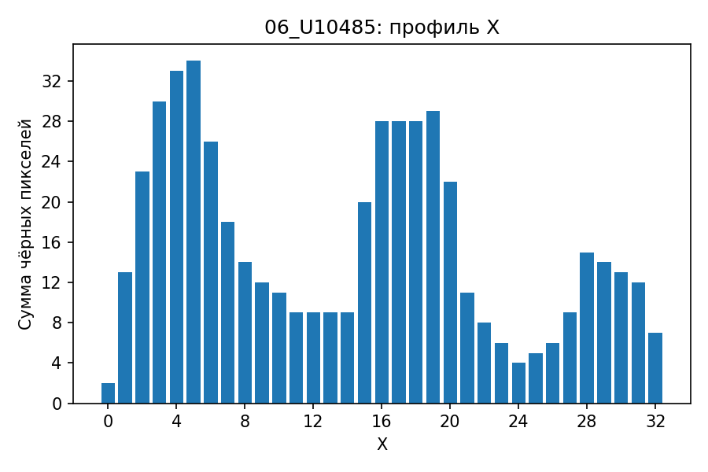

### Профиль Y

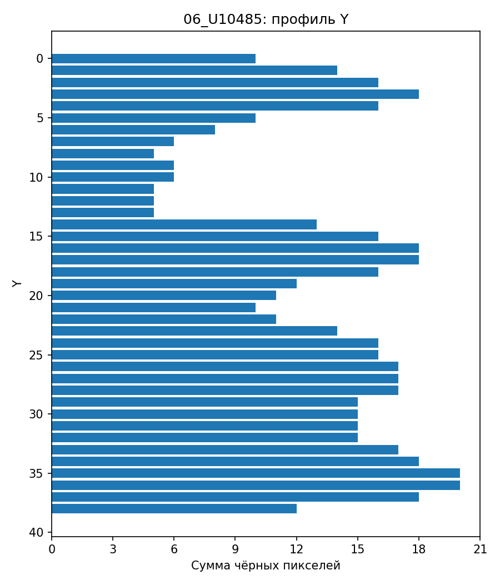

---
## Символ 7 — 𐒆

### Изображение символа

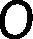

### Скалярные характеристики

| Признак | Значение |
|---|---:|
| Ширина изображения | 33 |
| Высота изображения | 39 |
| Общий вес чёрного | 511 |
| Общий удельный вес | 0.397047 |
| Вес 1-й четверти | 119 |
| Вес 2-й четверти | 132 |
| Вес 3-й четверти | 133 |
| Вес 4-й четверти | 127 |
| Удельный вес 1-й четверти | 0.391447 |
| Удельный вес 2-й четверти | 0.408669 |
| Удельный вес 3-й четверти | 0.415625 |
| Удельный вес 4-й четверти | 0.373529 |
| Координата центра тяжести X | 15.792564 |
| Координата центра тяжести Y | 19.005871 |
| Нормированная координата X | 0.493518 |
| Нормированная координата Y | 0.500154 |
| Осевой момент инерции Ix | 74096.982387 |
| Осевой момент инерции Iy | 57744.011742 |
| Нормированный момент инерции Ix | 0.044735 |
| Нормированный момент инерции Iy | 0.034862 |

### Профиль X

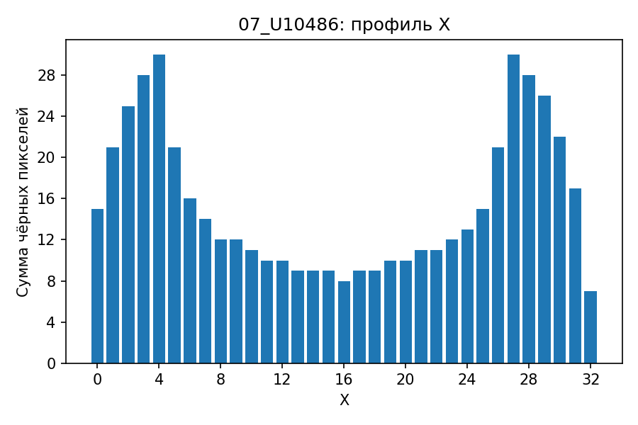

### Профиль Y

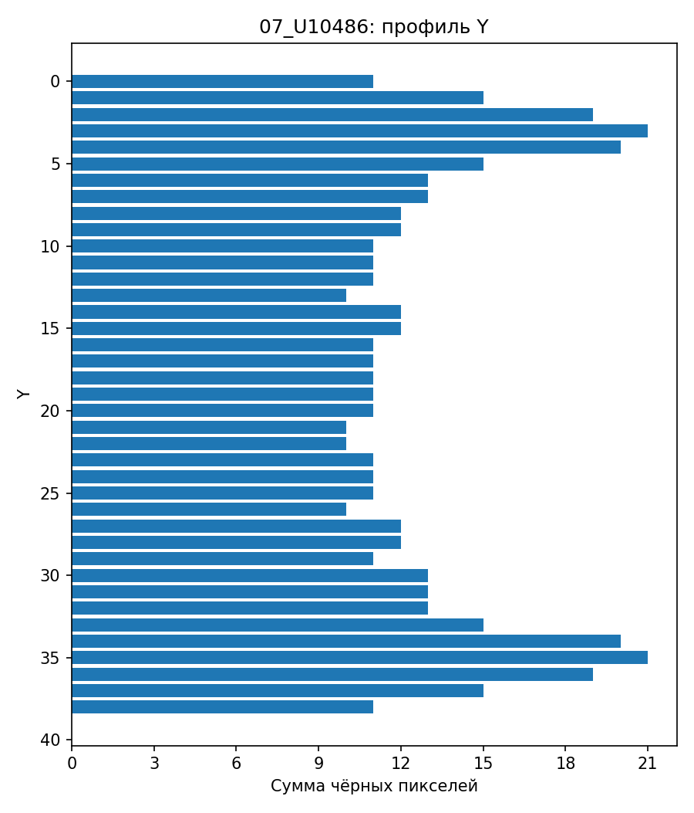

---
## Символ 8 — 𐒇

### Изображение символа

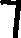

### Скалярные характеристики

| Признак | Значение |
|---|---:|
| Ширина изображения | 21 |
| Высота изображения | 38 |
| Общий вес чёрного | 266 |
| Общий удельный вес | 0.333333 |
| Вес 1-й четверти | 43 |
| Вес 2-й четверти | 124 |
| Вес 3-й четверти | 0 |
| Вес 4-й четверти | 99 |
| Удельный вес 1-й четверти | 0.226316 |
| Удельный вес 2-й четверти | 0.593301 |
| Удельный вес 3-й четверти | 0.000000 |
| Удельный вес 4-й четверти | 0.473684 |
| Координата центра тяжести X | 14.225564 |
| Координата центра тяжести Y | 14.285714 |
| Нормированная координата X | 0.711278 |
| Нормированная координата Y | 0.386100 |
| Осевой момент инерции Ix | 37264.285714 |
| Осевой момент инерции Iy | 6008.466165 |
| Нормированный момент инерции Ix | 0.058518 |
| Нормированный момент инерции Iy | 0.009435 |

### Профиль X

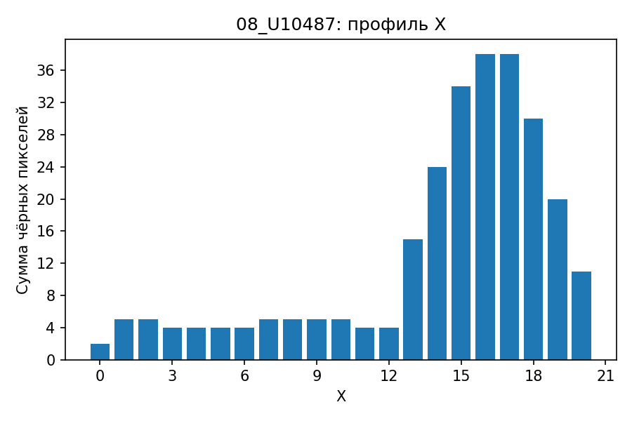

### Профиль Y

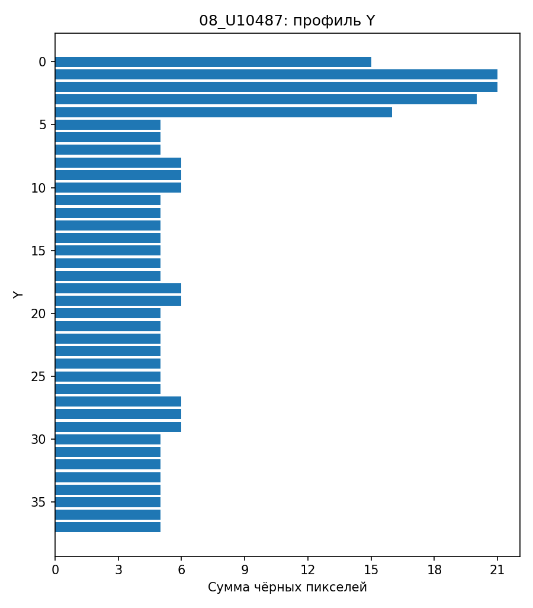

---
## Символ 9 — 𐒈

### Изображение символа

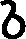

### Скалярные характеристики

| Признак | Значение |
|---|---:|
| Ширина изображения | 26 |
| Высота изображения | 39 |
| Общий вес чёрного | 424 |
| Общий удельный вес | 0.418146 |
| Вес 1-й четверти | 108 |
| Вес 2-й четверти | 70 |
| Вес 3-й четверти | 122 |
| Вес 4-й четверти | 124 |
| Удельный вес 1-й четверти | 0.437247 |
| Удельный вес 2-й четверти | 0.283401 |
| Удельный вес 3-й четверти | 0.469231 |
| Удельный вес 4-й четверти | 0.476923 |
| Координата центра тяжести X | 12.160377 |
| Координата центра тяжести Y | 20.570755 |
| Нормированная координата X | 0.486415 |
| Нормированная координата Y | 0.541336 |
| Осевой момент инерции Ix | 55197.877358 |
| Осевой момент инерции Iy | 18115.094340 |
| Нормированный момент инерции Ix | 0.053684 |
| Нормированный момент инерции Iy | 0.017618 |

### Профиль X

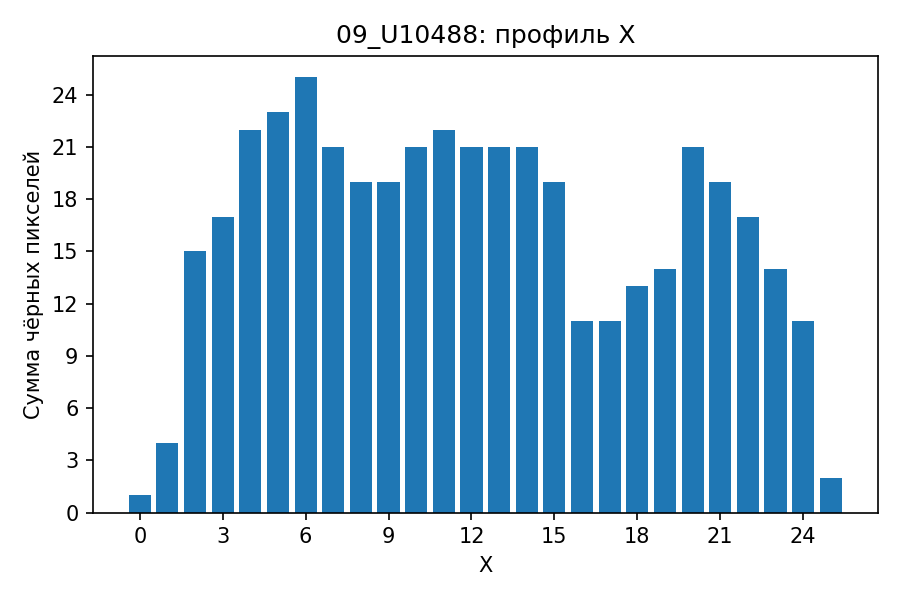

### Профиль Y

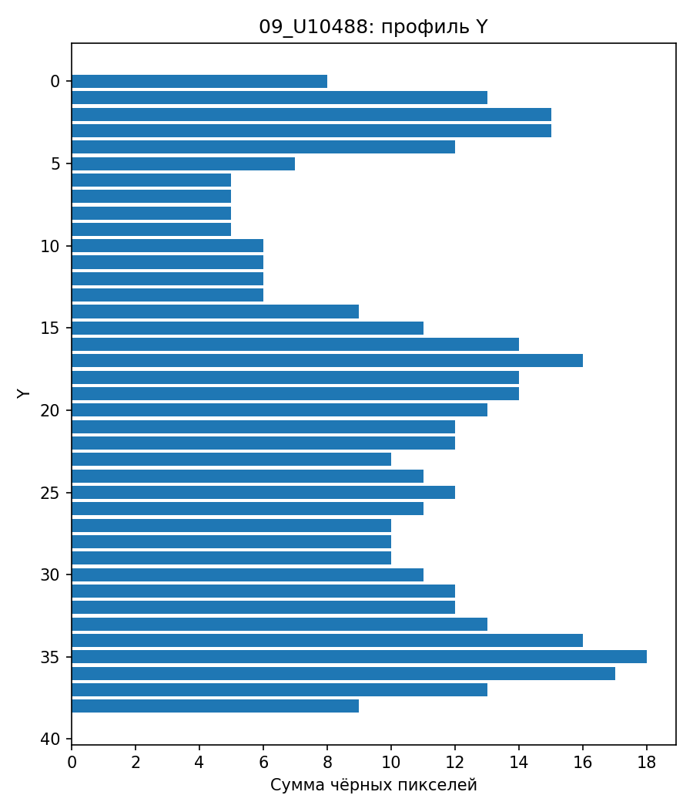

---
## Символ 10 — 𐒉

### Изображение символа

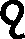

### Скалярные характеристики

| Признак | Значение |
|---|---:|
| Ширина изображения | 25 |
| Высота изображения | 39 |
| Общий вес чёрного | 434 |
| Общий удельный вес | 0.445128 |
| Вес 1-й четверти | 117 |
| Вес 2-й четверти | 120 |
| Вес 3-й четверти | 67 |
| Вес 4-й четверти | 130 |
| Удельный вес 1-й четверти | 0.513158 |
| Удельный вес 2-й четверти | 0.485830 |
| Удельный вес 3-й четверти | 0.279167 |
| Удельный вес 4-й четверти | 0.500000 |
| Координата центра тяжести X | 12.518433 |
| Координата центра тяжести Y | 17.486175 |
| Нормированная координата X | 0.521601 |
| Нормированная координата Y | 0.460163 |
| Осевой момент инерции Ix | 55724.417051 |
| Осевой момент инерции Iy | 18382.352535 |
| Нормированный момент инерции Ix | 0.058619 |
| Нормированный момент инерции Iy | 0.019337 |

### Профиль X

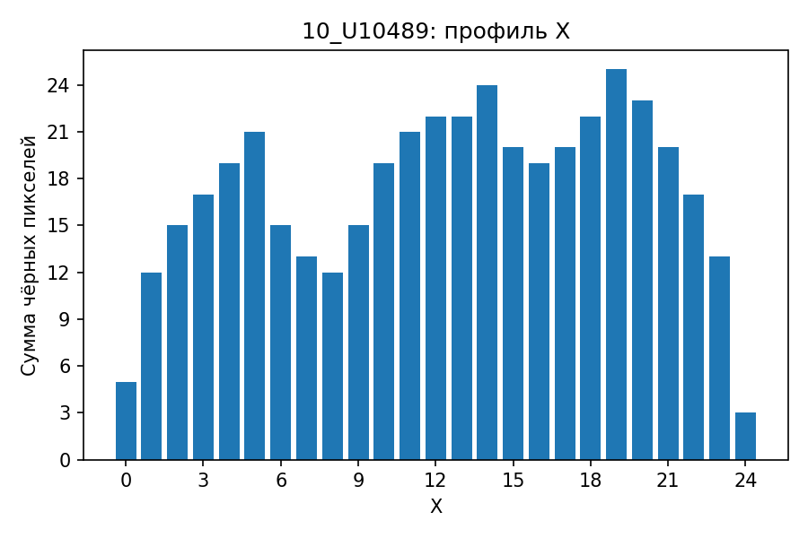

### Профиль Y

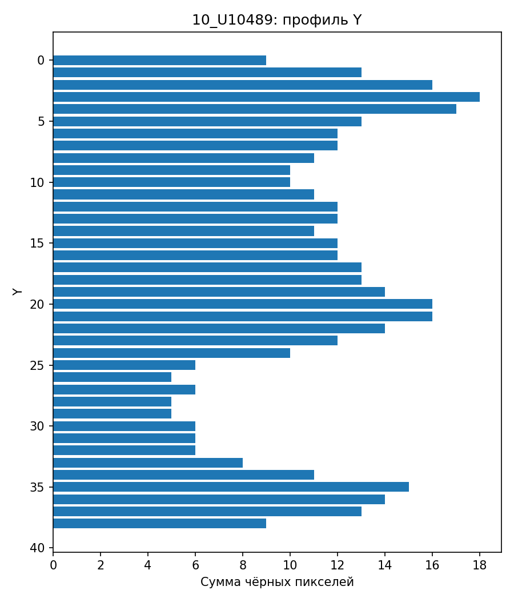

---
## Символ 11 — 𐒊

### Изображение символа

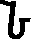

### Скалярные характеристики

| Признак | Значение |
|---|---:|
| Ширина изображения | 31 |
| Высота изображения | 39 |
| Общий вес чёрного | 385 |
| Общий удельный вес | 0.318445 |
| Вес 1-й четверти | 135 |
| Вес 2-й четверти | 18 |
| Вес 3-й четверти | 106 |
| Вес 4-й четверти | 126 |
| Удельный вес 1-й четверти | 0.473684 |
| Удельный вес 2-й четверти | 0.059211 |
| Удельный вес 3-й четверти | 0.353333 |
| Удельный вес 4-й четверти | 0.393750 |
| Координата центра тяжести X | 14.283117 |
| Координата центра тяжести Y | 20.093506 |
| Нормированная координата X | 0.476104 |
| Нормированная координата Y | 0.528776 |
| Осевой момент инерции Ix | 50874.633766 |
| Осевой момент инерции Iy | 16024.140260 |
| Нормированный момент инерции Ix | 0.034806 |
| Нормированный момент инерции Iy | 0.010963 |

### Профиль X

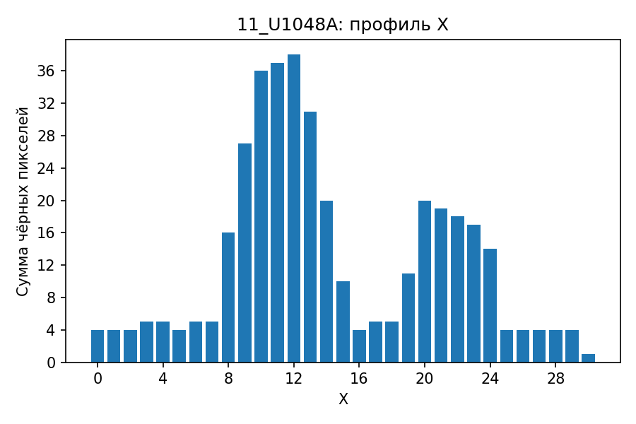

### Профиль Y

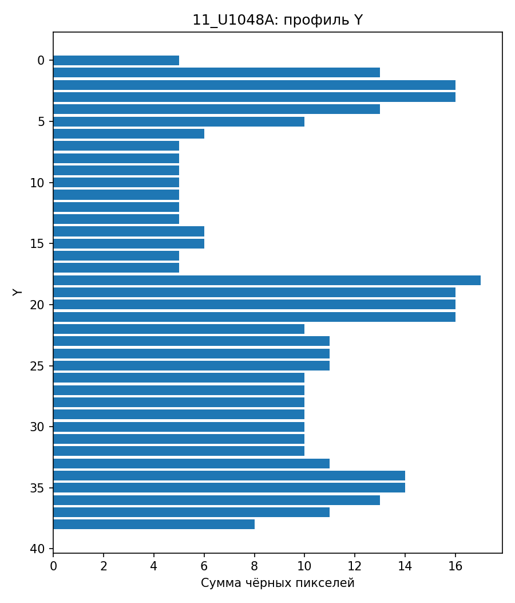

---
## Символ 12 — 𐒋

### Изображение символа

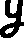

### Скалярные характеристики

| Признак | Значение |
|---|---:|
| Ширина изображения | 24 |
| Высота изображения | 38 |
| Общий вес чёрного | 446 |
| Общий удельный вес | 0.489035 |
| Вес 1-й четверти | 96 |
| Вес 2-й четверти | 120 |
| Вес 3-й четверти | 117 |
| Вес 4-й четверти | 113 |
| Удельный вес 1-й четверти | 0.421053 |
| Удельный вес 2-й четверти | 0.526316 |
| Удельный вес 3-й четверти | 0.513158 |
| Удельный вес 4-й четверти | 0.495614 |
| Координата центра тяжести X | 12.134529 |
| Координата центра тяжести Y | 19.197309 |
| Нормированная координата X | 0.527588 |
| Нормированная координата Y | 0.518846 |
| Осевой момент инерции Ix | 52266.636771 |
| Осевой момент инерции Iy | 16709.928251 |
| Нормированный момент инерции Ix | 0.062840 |
| Нормированный момент инерции Iy | 0.020090 |

### Профиль X

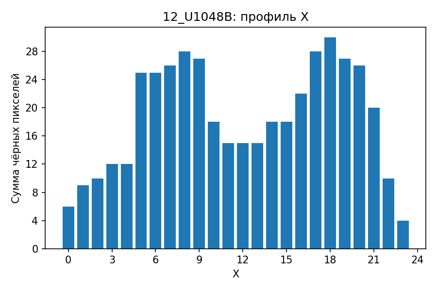

### Профиль Y

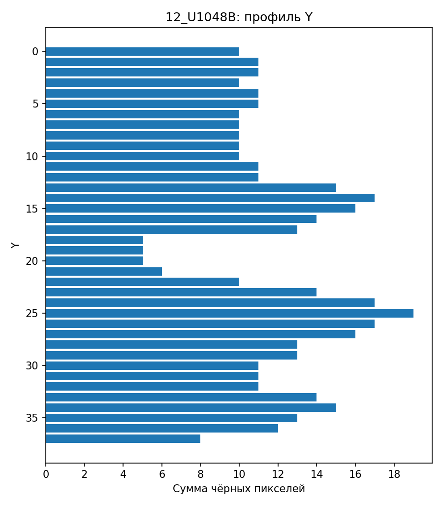

---
## Символ 13 — 𐒌

### Изображение символа

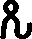

### Скалярные характеристики

| Признак | Значение |
|---|---:|
| Ширина изображения | 32 |
| Высота изображения | 39 |
| Общий вес чёрного | 524 |
| Общий удельный вес | 0.419872 |
| Вес 1-й четверти | 186 |
| Вес 2-й четверти | 27 |
| Вес 3-й четверти | 137 |
| Вес 4-й четверти | 174 |
| Удельный вес 1-й четверти | 0.611842 |
| Удельный вес 2-й четверти | 0.088816 |
| Удельный вес 3-й четверти | 0.428125 |
| Удельный вес 4-й четверти | 0.543750 |
| Координата центра тяжести X | 13.379771 |
| Координата центра тяжести Y | 20.851145 |
| Нормированная координата X | 0.431606 |
| Нормированная координата Y | 0.548714 |
| Осевой момент инерции Ix | 66352.389313 |
| Осевой момент инерции Iy | 36435.425573 |
| Нормированный момент инерции Ix | 0.042602 |
| Нормированный момент инерции Iy | 0.023393 |

### Профиль X

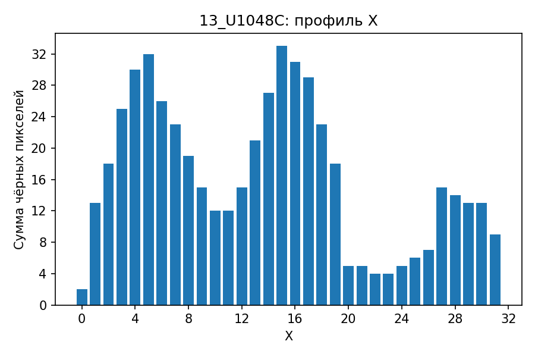

### Профиль Y

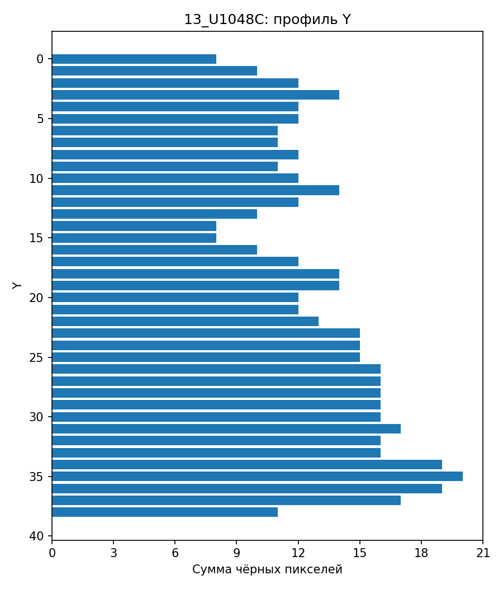

---
## Символ 14 — 𐒍

### Изображение символа

### Скалярные характеристики

| Признак | Значение |
|---|---:|
| Ширина изображения | 28 |
| Высота изображения | 38 |
| Общий вес чёрного | 407 |
| Общий удельный вес | 0.382519 |
| Вес 1-й четверти | 144 |
| Вес 2-й четверти | 73 |
| Вес 3-й четверти | 52 |
| Вес 4-й четверти | 138 |
| Удельный вес 1-й четверти | 0.541353 |
| Удельный вес 2-й четверти | 0.274436 |
| Удельный вес 3-й четверти | 0.195489 |
| Удельный вес 4-й четверти | 0.518797 |
| Координата центра тяжести X | 13.292383 |
| Координата центра тяжести Y | 18.508600 |
| Нормированная координата X | 0.492310 |
| Нормированная координата Y | 0.500232 |
| Осевой момент инерции Ix | 49957.719902 |
| Осевой момент инерции Iy | 21184.206388 |
| Нормированный момент инерции Ix | 0.044129 |
| Нормированный момент инерции Iy | 0.018712 |

### Профиль X

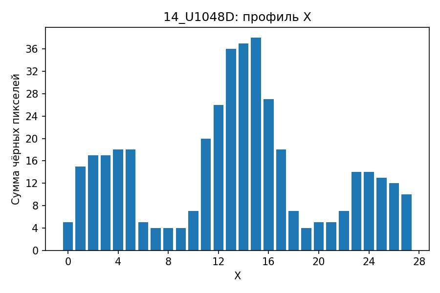

### Профиль Y

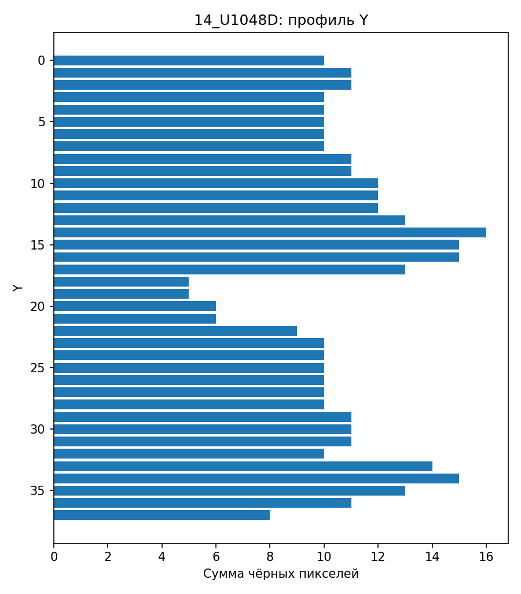

---
## Символ 15 — 𐒎

### Изображение символа

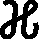

### Скалярные характеристики

| Признак | Значение |
|---|---:|
| Ширина изображения | 39 |
| Высота изображения | 39 |
| Общий вес чёрного | 765 |
| Общий удельный вес | 0.502959 |
| Вес 1-й четверти | 142 |
| Вес 2-й четверти | 197 |
| Вес 3-й четверти | 224 |
| Вес 4-й четверти | 202 |
| Удельный вес 1-й четверти | 0.393352 |
| Удельный вес 2-й четверти | 0.518421 |
| Удельный вес 3-й четверти | 0.589474 |
| Удельный вес 4-й четверти | 0.505000 |
| Координата центра тяжести X | 19.688889 |
| Координата центра тяжести Y | 19.773856 |
| Нормированная координата X | 0.518129 |
| Нормированная координата Y | 0.520365 |
| Осевой момент инерции Ix | 103319.877124 |
| Осевой момент инерции Iy | 83617.955556 |
| Нормированный момент инерции Ix | 0.044661 |
| Нормированный момент инерции Iy | 0.036144 |

### Профиль X

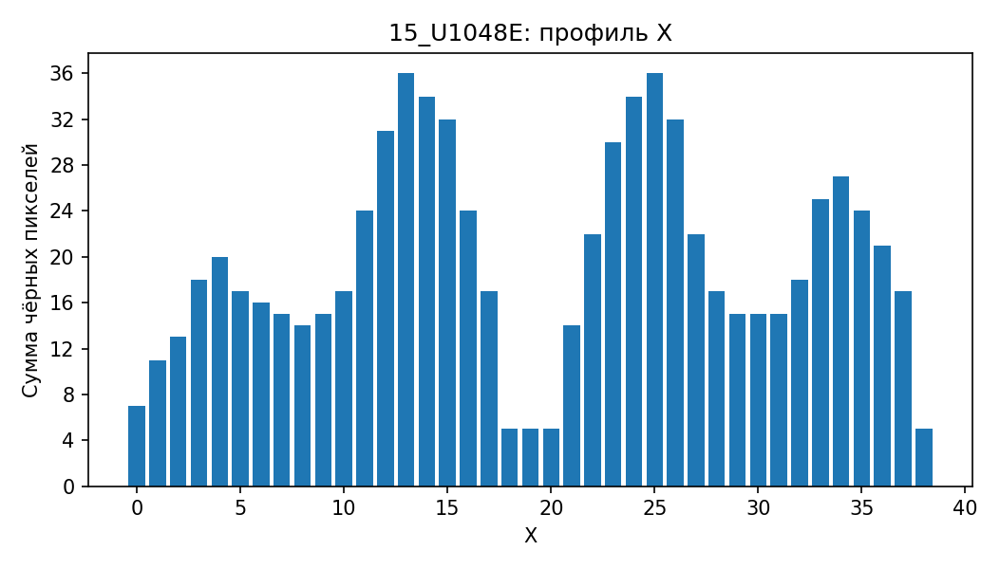

### Профиль Y

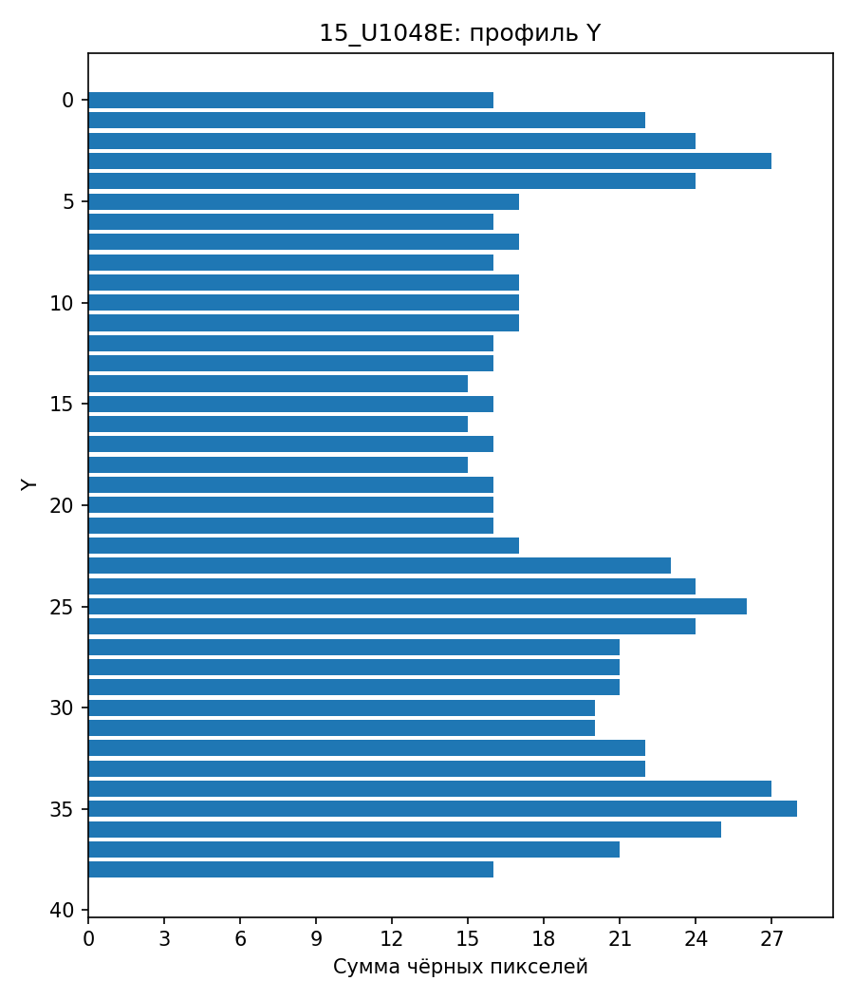

---
## Символ 16 — 𐒏

### Изображение символа

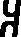

### Скалярные характеристики

| Признак | Значение |
|---|---:|
| Ширина изображения | 21 |
| Высота изображения | 37 |
| Общий вес чёрного | 416 |
| Общий удельный вес | 0.535393 |
| Вес 1-й четверти | 92 |
| Вес 2-й четверти | 114 |
| Вес 3-й четверти | 94 |
| Вес 4-й четверти | 116 |
| Удельный вес 1-й четверти | 0.511111 |
| Удельный вес 2-й четверти | 0.575758 |
| Удельный вес 3-й четверти | 0.494737 |
| Удельный вес 4-й четверти | 0.555024 |
| Координата центра тяжести X | 10.567308 |
| Координата центра тяжести Y | 18.067308 |
| Нормированная координата X | 0.528365 |
| Нормированная координата Y | 0.501870 |
| Осевой момент инерции Ix | 45602.115385 |
| Осевой момент инерции Iy | 14326.115385 |
| Нормированный момент инерции Ix | 0.075534 |
| Нормированный момент инерции Iy | 0.023729 |

### Профиль X

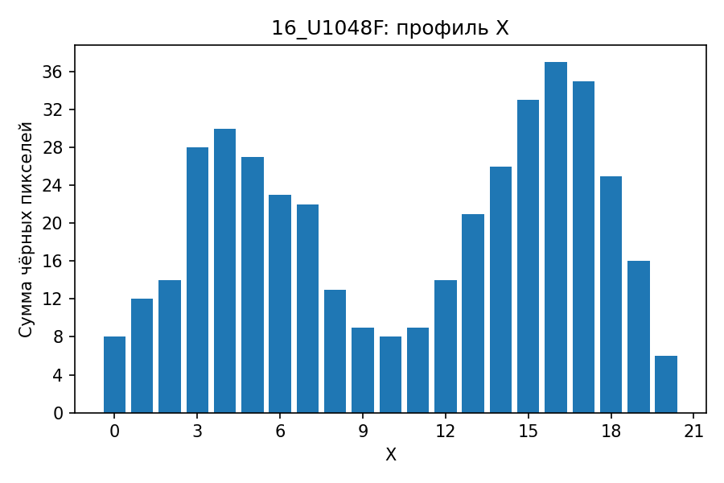

### Профиль Y

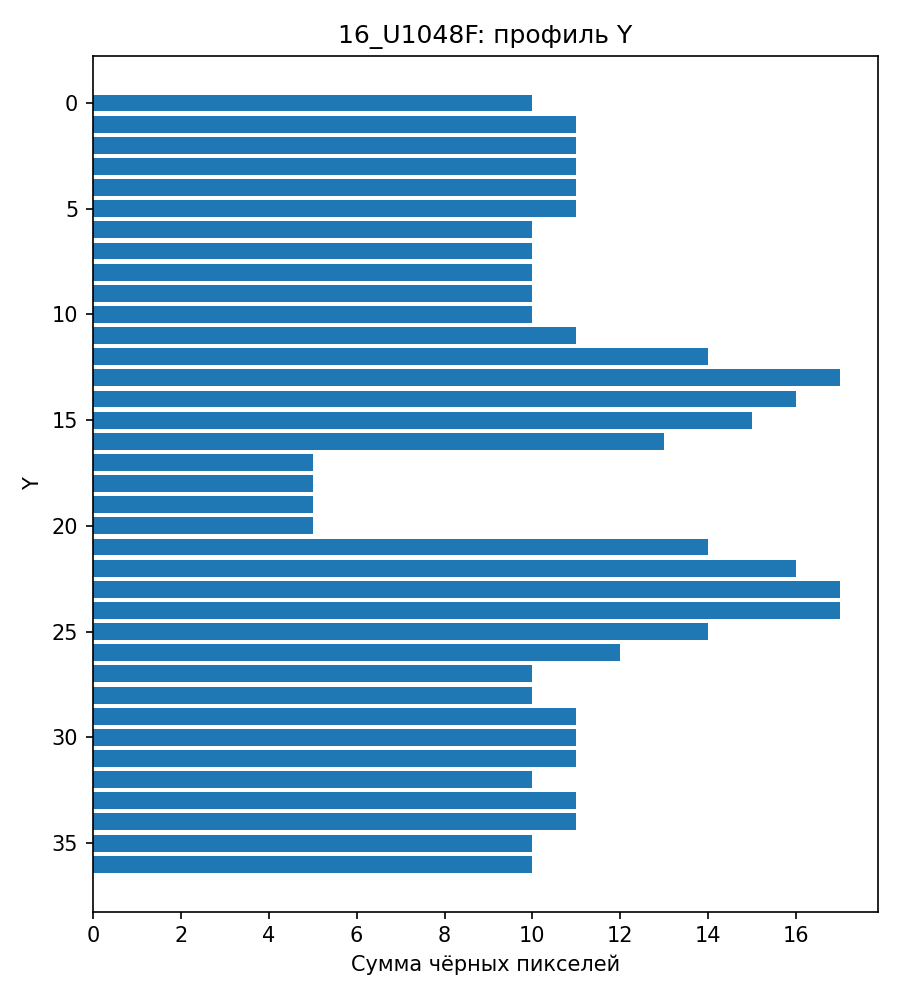

---
## Символ 17 — 𐒐

### Изображение символа

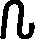

### Скалярные характеристики

| Признак | Значение |
|---|---:|
| Ширина изображения | 35 |
| Высота изображения | 39 |
| Общий вес чёрного | 526 |
| Общий удельный вес | 0.385348 |
| Вес 1-й четверти | 123 |
| Вес 2-й четверти | 100 |
| Вес 3-й четверти | 103 |
| Вес 4-й четверти | 200 |
| Удельный вес 1-й четверти | 0.380805 |
| Удельный вес 2-й четверти | 0.292398 |
| Удельный вес 3-й четверти | 0.302941 |
| Удельный вес 4-й четверти | 0.555556 |
| Координата центра тяжести X | 15.598859 |
| Координата центра тяжести Y | 20.439163 |
| Нормированная координата X | 0.458790 |
| Нормированная координата Y | 0.537873 |
| Осевой момент инерции Ix | 70637.553232 |
| Осевой момент инерции Iy | 49678.359316 |
| Нормированный момент инерции Ix | 0.037911 |
| Нормированный момент инерции Iy | 0.026663 |

### Профиль X

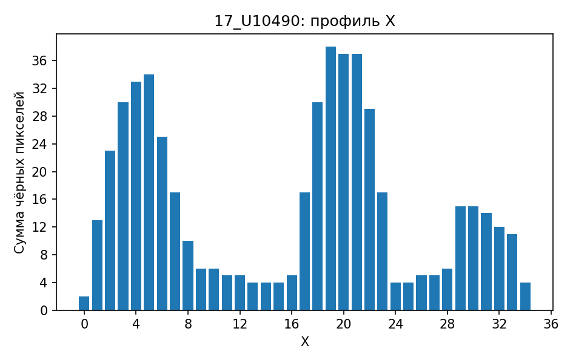

### Профиль Y

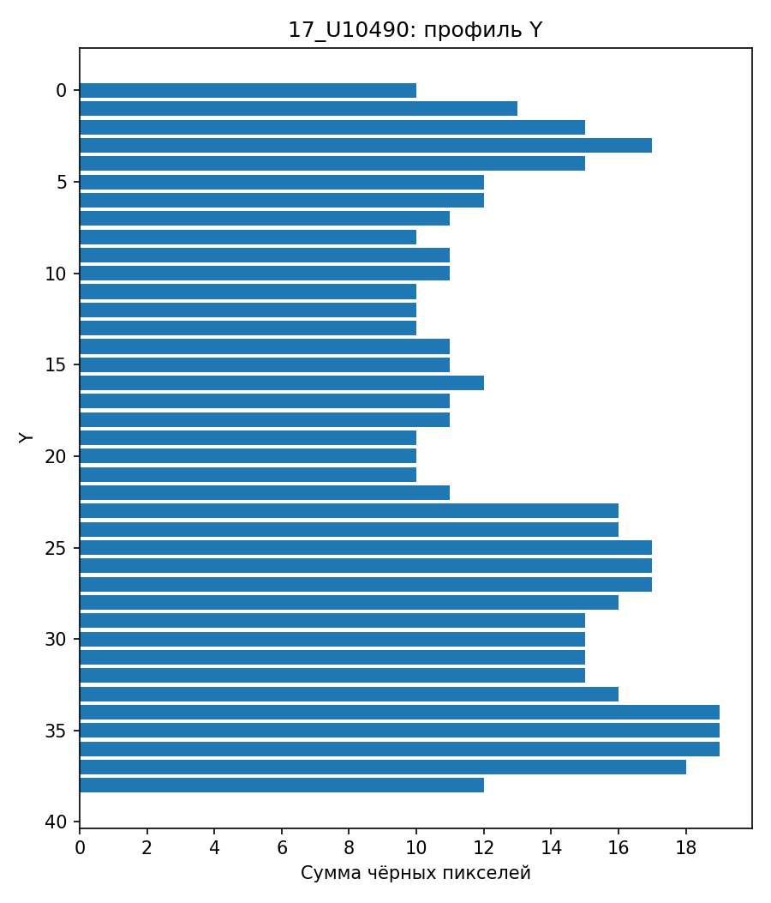

---
## Символ 18 — 𐒑

### Изображение символа

### Скалярные характеристики

| Признак | Значение |
|---|---:|
| Ширина изображения | 23 |
| Высота изображения | 38 |
| Общий вес чёрного | 356 |
| Общий удельный вес | 0.407323 |
| Вес 1-й четверти | 118 |
| Вес 2-й четверти | 50 |
| Вес 3-й четверти | 70 |
| Вес 4-й четверти | 118 |
| Удельный вес 1-й четверти | 0.564593 |
| Удельный вес 2-й четверти | 0.219298 |
| Удельный вес 3-й четверти | 0.334928 |
| Удельный вес 4-й четверти | 0.517544 |
| Координата центра тяжести X | 10.713483 |
| Координата центра тяжести Y | 20.820225 |
| Нормированная координата X | 0.486977 |
| Нормированная координата Y | 0.562709 |
| Осевой момент инерции Ix | 39352.494382 |
| Осевой момент инерции Iy | 15240.775281 |
| Нормированный момент инерции Ix | 0.051517 |
| Нормированный момент инерции Iy | 0.019952 |

### Профиль X

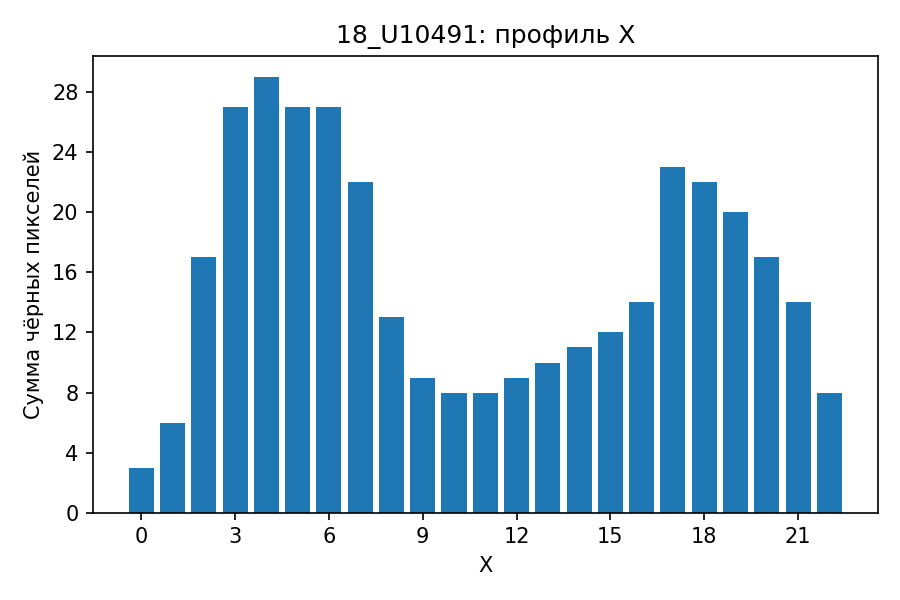

### Профиль Y

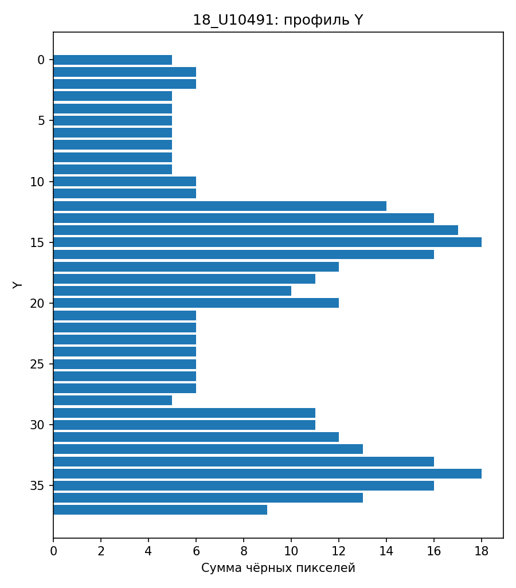

---
## Символ 19 — 𐒒

### Изображение символа

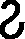

### Скалярные характеристики

| Признак | Значение |
|---|---:|
| Ширина изображения | 25 |
| Высота изображения | 39 |
| Общий вес чёрного | 414 |
| Общий удельный вес | 0.424615 |
| Вес 1-й четверти | 70 |
| Вес 2-й четверти | 103 |
| Вес 3-й четверти | 137 |
| Вес 4-й четверти | 104 |
| Удельный вес 1-й четверти | 0.307018 |
| Удельный вес 2-й четверти | 0.417004 |
| Удельный вес 3-й четверти | 0.570833 |
| Удельный вес 4-й четверти | 0.400000 |
| Координата центра тяжести X | 11.166667 |
| Координата центра тяжести Y | 20.135266 |
| Нормированная координата X | 0.465278 |
| Нормированная координата Y | 0.529875 |
| Осевой момент инерции Ix | 61420.425121 |
| Осевой момент инерции Iy | 17761.500000 |
| Нормированный момент инерции Ix | 0.064611 |
| Нормированный момент инерции Iy | 0.018684 |

### Профиль X

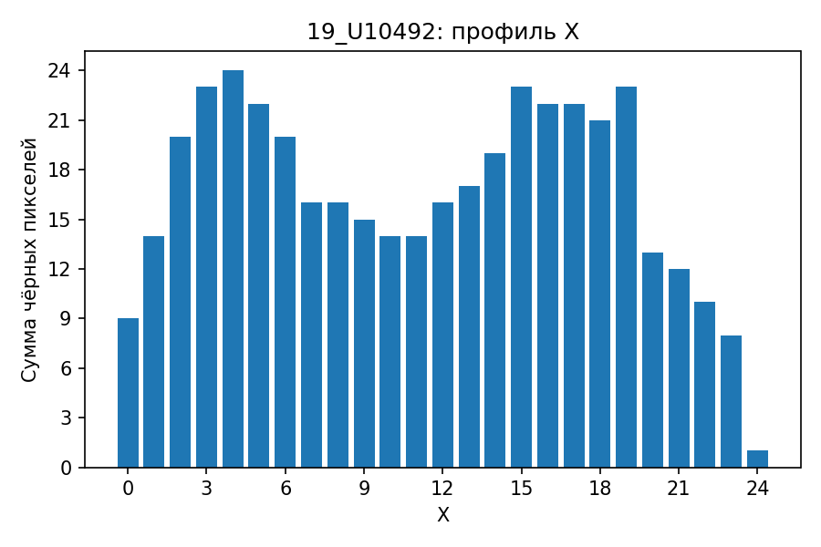

### Профиль Y

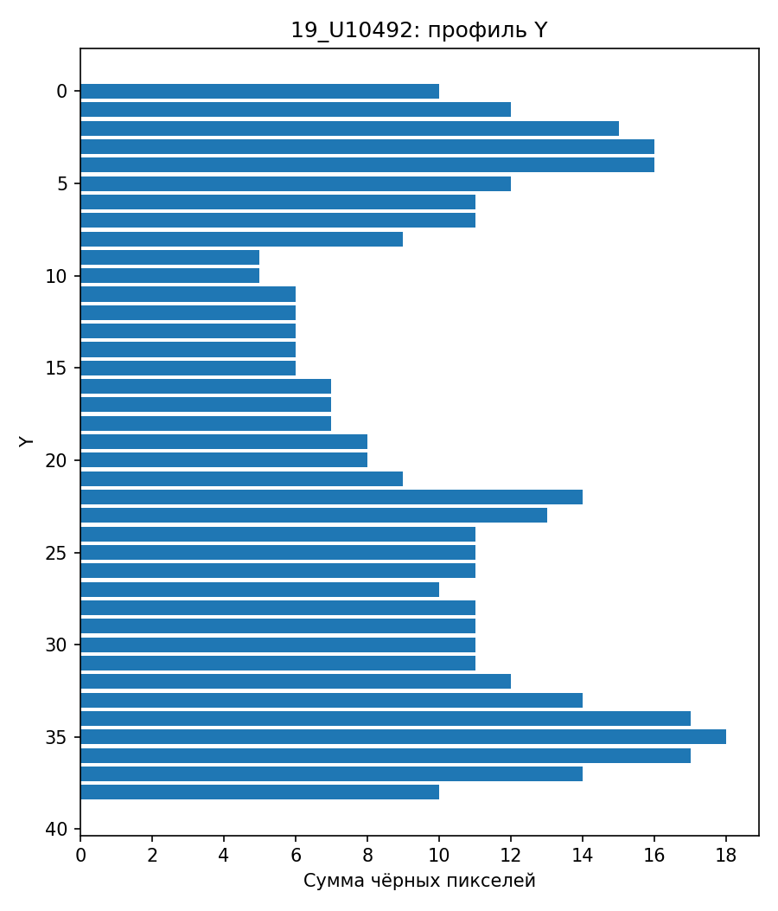

---
## Символ 20 — 𐒓

### Изображение символа

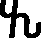

### Скалярные характеристики

| Признак | Значение |
|---|---:|
| Ширина изображения | 41 |
| Высота изображения | 38 |
| Общий вес чёрного | 567 |
| Общий удельный вес | 0.363928 |
| Вес 1-й четверти | 230 |
| Вес 2-й четверти | 42 |
| Вес 3-й четверти | 101 |
| Вес 4-й четверти | 194 |
| Удельный вес 1-й четверти | 0.605263 |
| Удельный вес 2-й четверти | 0.105263 |
| Удельный вес 3-й четверти | 0.265789 |
| Удельный вес 4-й четверти | 0.486216 |
| Координата центра тяжести X | 18.350970 |
| Координата центра тяжести Y | 20.029982 |
| Нормированная координата X | 0.458774 |
| Нормированная координата Y | 0.541351 |
| Осевой момент инерции Ix | 62436.490300 |
| Осевой момент инерции Iy | 71281.156966 |
| Нормированный момент инерции Ix | 0.025722 |
| Нормированный момент инерции Iy | 0.029366 |

### Профиль X

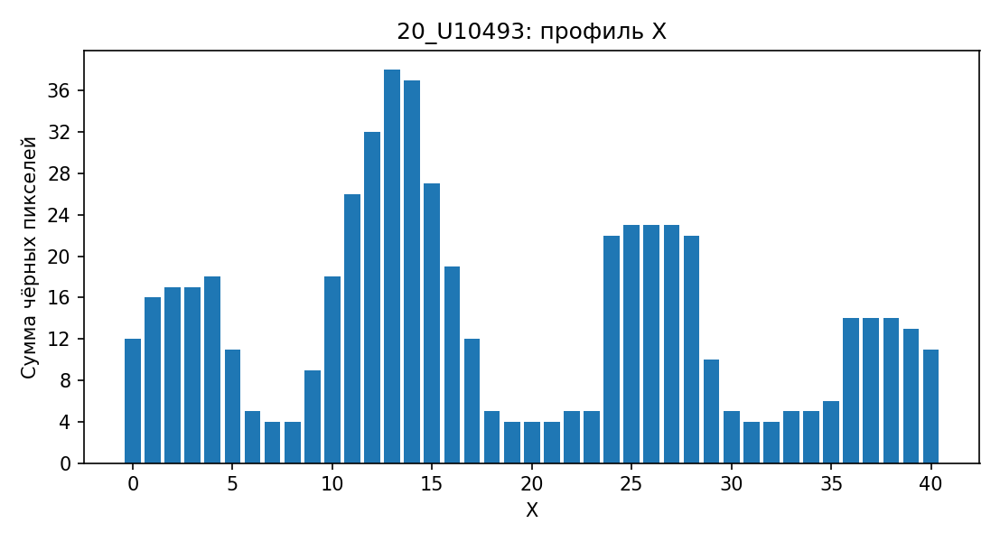

### Профиль Y

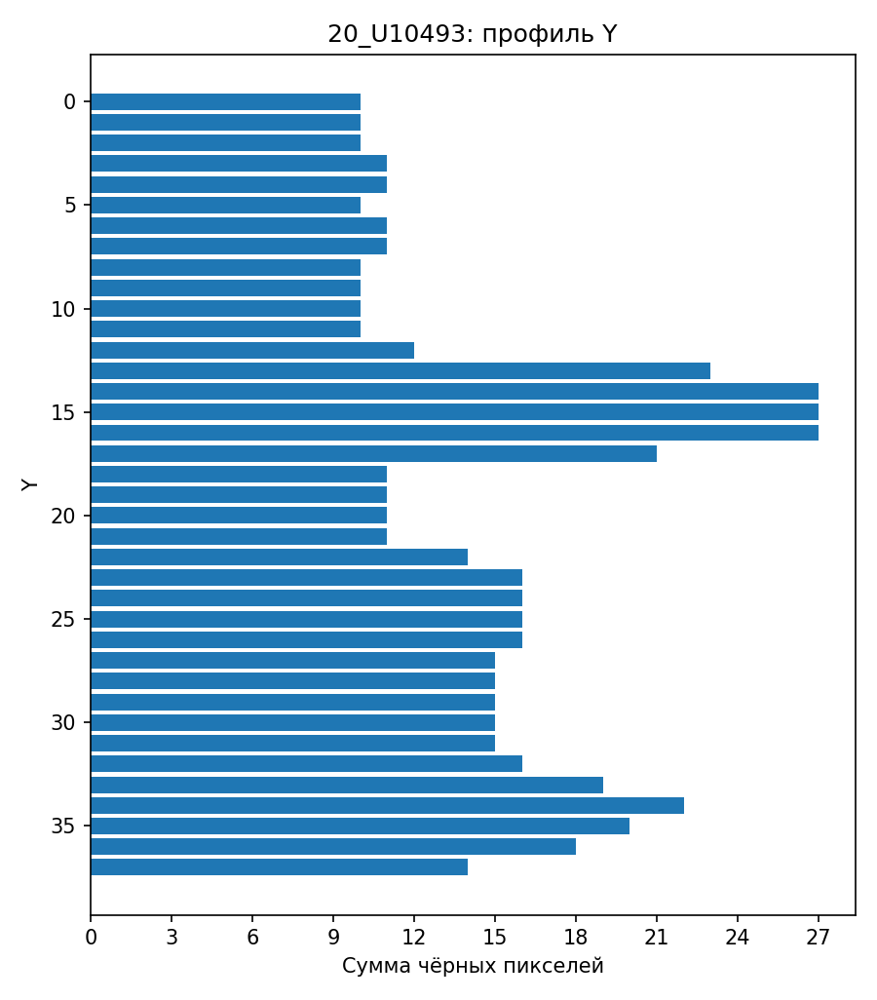

---
## Символ 21 — 𐒔

### Изображение символа

### Скалярные характеристики

| Признак | Значение |
|---|---:|
| Ширина изображения | 26 |
| Высота изображения | 38 |
| Общий вес чёрного | 461 |
| Общий удельный вес | 0.466599 |
| Вес 1-й четверти | 120 |
| Вес 2-й четверти | 114 |
| Вес 3-й четверти | 123 |
| Вес 4-й четверти | 104 |
| Удельный вес 1-й четверти | 0.485830 |
| Удельный вес 2-й четверти | 0.461538 |
| Удельный вес 3-й четверти | 0.497976 |
| Удельный вес 4-й четверти | 0.421053 |
| Координата центра тяжести X | 12.199566 |
| Координата центра тяжести Y | 19.399132 |
| Нормированная координата X | 0.487983 |
| Нормированная координата Y | 0.524301 |
| Осевой момент инерции Ix | 56020.559653 |
| Осевой момент инерции Iy | 24313.639913 |
| Нормированный момент инерции Ix | 0.057390 |
| Нормированный момент инерции Iy | 0.024908 |

### Профиль X

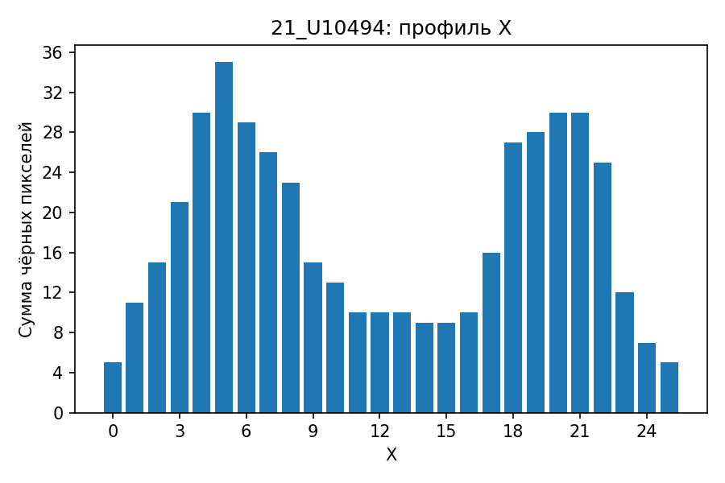

### Профиль Y

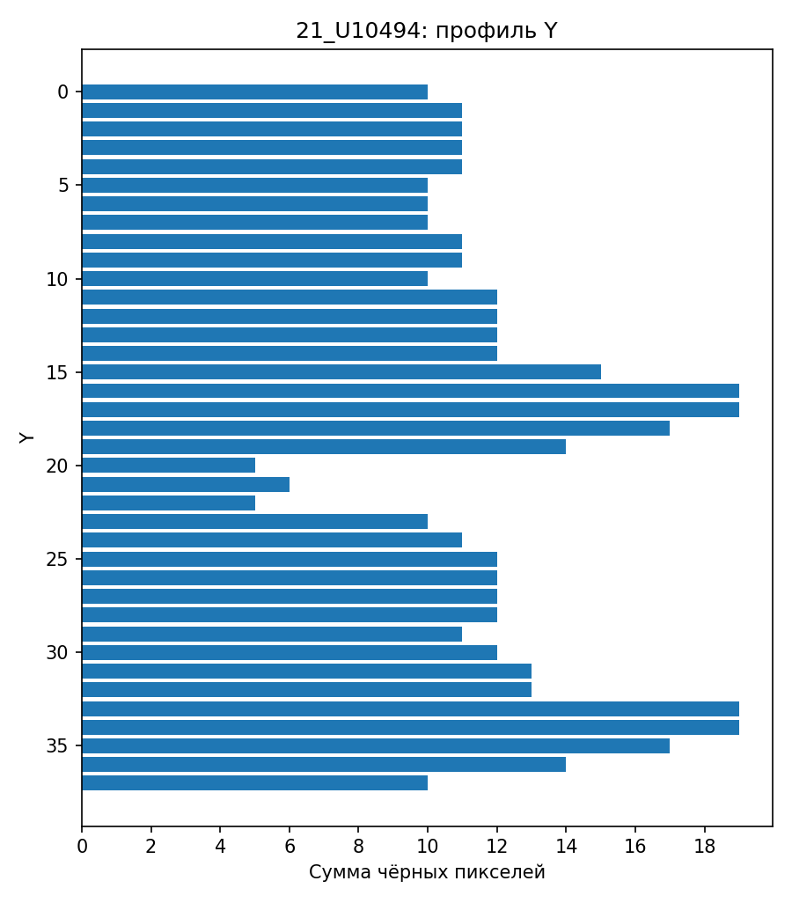

---
## Символ 22 — 𐒕

### Изображение символа

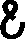

### Скалярные характеристики

| Признак | Значение |
|---|---:|
| Ширина изображения | 25 |
| Высота изображения | 39 |
| Общий вес чёрного | 442 |
| Общий удельный вес | 0.453333 |
| Вес 1-й четверти | 131 |
| Вес 2-й четверти | 82 |
| Вес 3-й четверти | 126 |
| Вес 4-й четверти | 103 |
| Удельный вес 1-й четверти | 0.574561 |
| Удельный вес 2-й четверти | 0.331984 |
| Удельный вес 3-й четверти | 0.525000 |
| Удельный вес 4-й четверти | 0.396154 |
| Координата центра тяжести X | 10.346154 |
| Координата центра тяжести Y | 19.554299 |
| Нормированная координата X | 0.431090 |
| Нормированная координата Y | 0.514587 |
| Осевой момент инерции Ix | 60363.196833 |
| Осевой момент инерции Iy | 17452.038462 |
| Нормированный момент инерции Ix | 0.063498 |
| Нормированный момент инерции Iy | 0.018358 |

### Профиль X

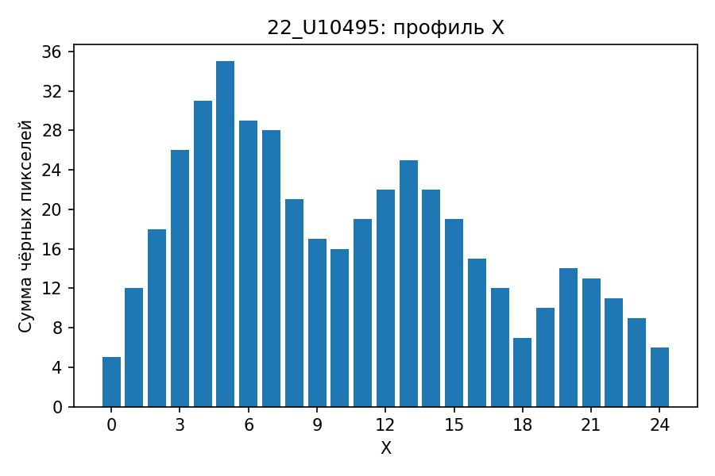

### Профиль Y

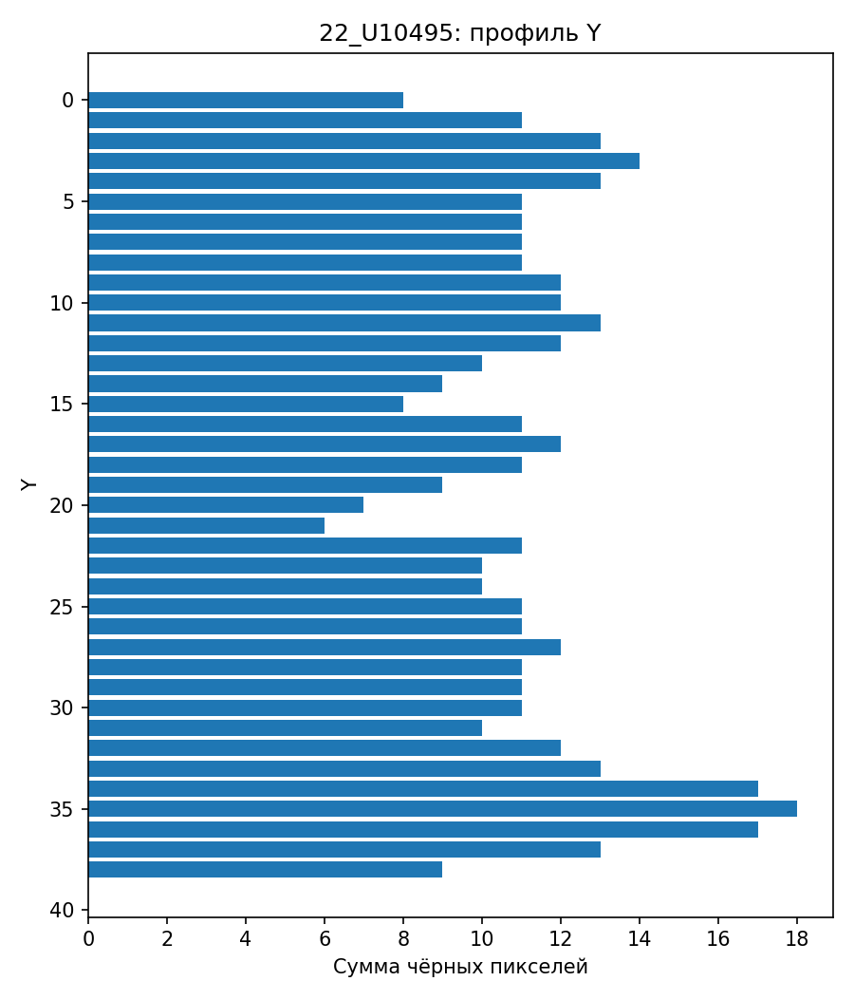

---
## Символ 23 — 𐒖

### Изображение символа

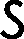

### Скалярные характеристики

| Признак | Значение |
|---|---:|
| Ширина изображения | 24 |
| Высота изображения | 39 |
| Общий вес чёрного | 360 |
| Общий удельный вес | 0.384615 |
| Вес 1-й четверти | 99 |
| Вес 2-й четверти | 69 |
| Вес 3-й четверти | 57 |
| Вес 4-й четверти | 135 |
| Удельный вес 1-й четверти | 0.434211 |
| Удельный вес 2-й четверти | 0.302632 |
| Удельный вес 3-й четверти | 0.237500 |
| Удельный вес 4-й четверти | 0.562500 |
| Координата центра тяжести X | 12.950000 |
| Координата центра тяжести Y | 19.819444 |
| Нормированная координата X | 0.563043 |
| Нормированная координата Y | 0.521564 |
| Осевой момент инерции Ix | 57501.263889 |
| Осевой момент инерции Iy | 12193.100000 |
| Нормированный момент инерции Ix | 0.065634 |
| Нормированный момент инерции Iy | 0.013918 |

### Профиль X

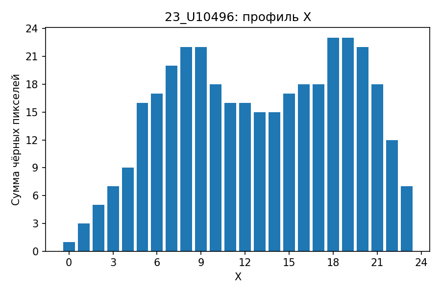

### Профиль Y

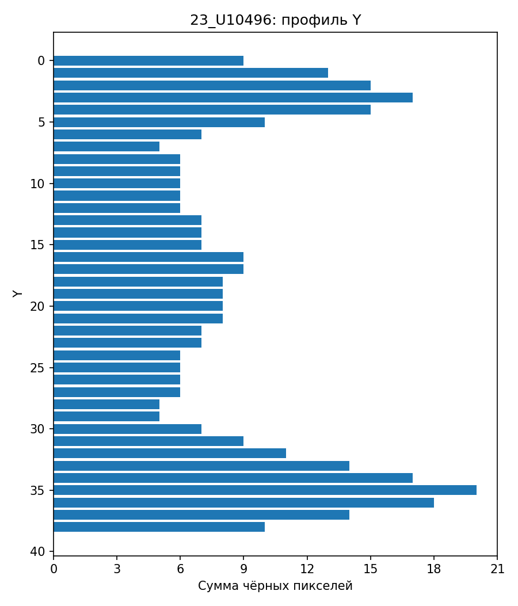

---
## Символ 24 — 𐒗

### Изображение символа

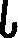

### Скалярные характеристики

| Признак | Значение |
|---|---:|
| Ширина изображения | 18 |
| Высота изображения | 38 |
| Общий вес чёрного | 289 |
| Общий удельный вес | 0.422515 |
| Вес 1-й четверти | 99 |
| Вес 2-й четверти | 0 |
| Вес 3-й четверти | 107 |
| Вес 4-й четверти | 83 |
| Удельный вес 1-й четверти | 0.578947 |
| Удельный вес 2-й четверти | 0.000000 |
| Удельный вес 3-й четверти | 0.625731 |
| Удельный вес 4-й четверти | 0.485380 |
| Координата центра тяжести X | 6.276817 |
| Координата центра тяжести Y | 22.083045 |
| Нормированная координата X | 0.369225 |
| Нормированная координата Y | 0.596839 |
| Осевой момент инерции Ix | 33646.006920 |
| Осевой момент инерции Iy | 6541.854671 |
| Нормированный момент инерции Ix | 0.071915 |
| Нормированный момент инерции Iy | 0.013983 |

### Профиль X

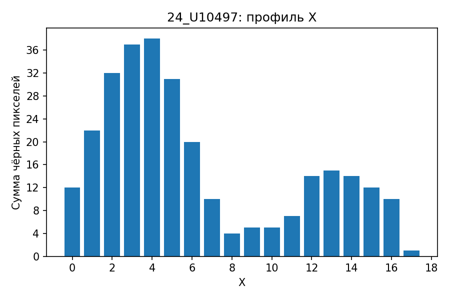

### Профиль Y

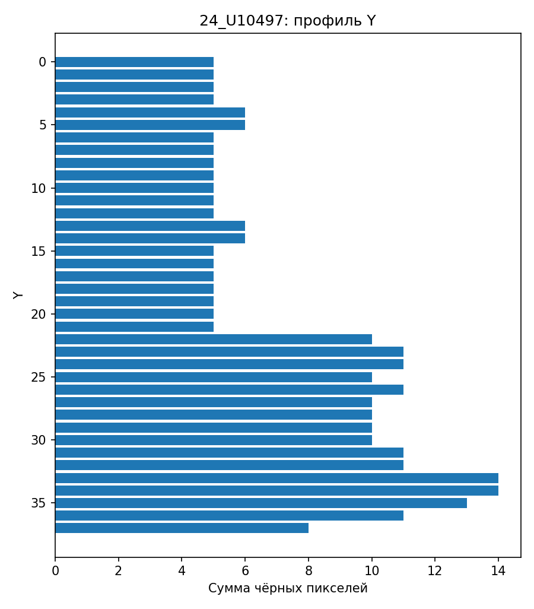

---
## Символ 25 — 𐒘

### Изображение символа

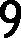

### Скалярные характеристики

| Признак | Значение |
|---|---:|
| Ширина изображения | 21 |
| Высота изображения | 38 |
| Общий вес чёрного | 385 |
| Общий удельный вес | 0.482456 |
| Вес 1-й четверти | 110 |
| Вес 2-й четверти | 118 |
| Вес 3-й четверти | 54 |
| Вес 4-й четверти | 103 |
| Удельный вес 1-й четверти | 0.578947 |
| Удельный вес 2-й четверти | 0.564593 |
| Удельный вес 3-й четверти | 0.284211 |
| Удельный вес 4-й четверти | 0.492823 |
| Координата центра тяжести X | 10.685714 |
| Координата центра тяжести Y | 16.033766 |
| Нормированная координата X | 0.534286 |
| Нормированная координата Y | 0.433345 |
| Осевой момент инерции Ix | 40358.561039 |
| Осевой момент инерции Iy | 13566.971429 |
| Нормированный момент инерции Ix | 0.063377 |
| Нормированный момент инерции Iy | 0.021305 |

### Профиль X

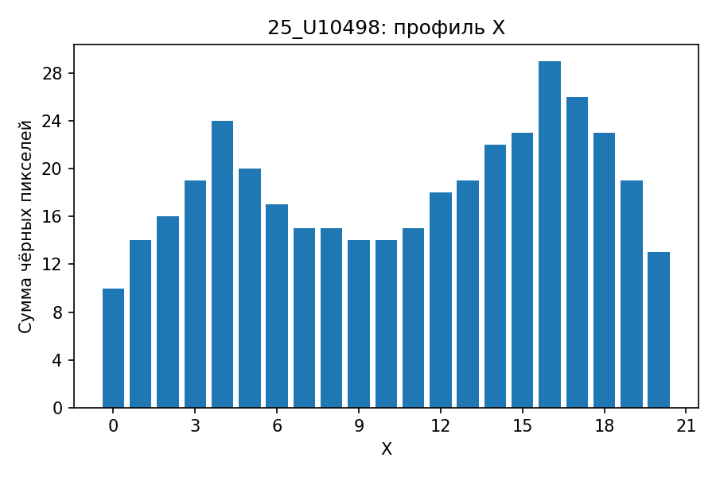

### Профиль Y

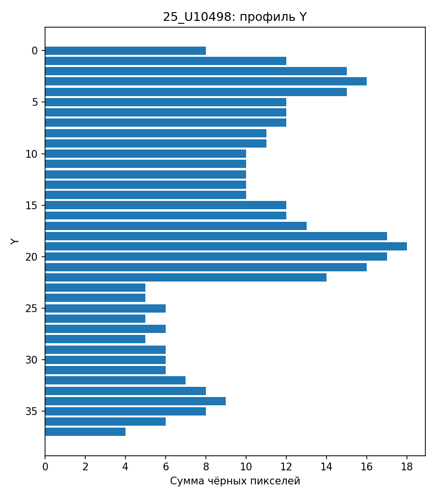

---
## Символ 26 — 𐒙

### Изображение символа

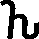

### Скалярные характеристики

| Признак | Значение |
|---|---:|
| Ширина изображения | 39 |
| Высота изображения | 39 |
| Общий вес чёрного | 492 |
| Общий удельный вес | 0.323471 |
| Вес 1-й четверти | 151 |
| Вес 2-й четверти | 33 |
| Вес 3-й четверти | 105 |
| Вес 4-й четверти | 203 |
| Удельный вес 1-й четверти | 0.418283 |
| Удельный вес 2-й четверти | 0.086842 |
| Удельный вес 3-й четверти | 0.276316 |
| Удельный вес 4-й четверти | 0.507500 |
| Координата центра тяжести X | 18.936992 |
| Координата центра тяжести Y | 21.934959 |
| Нормированная координата X | 0.498342 |
| Нормированная координата Y | 0.577236 |
| Осевой момент инерции Ix | 60105.918699 |
| Осевой момент инерции Iy | 49439.046748 |
| Нормированный момент инерции Ix | 0.025981 |
| Нормированный момент инерции Iy | 0.021370 |

### Профиль X

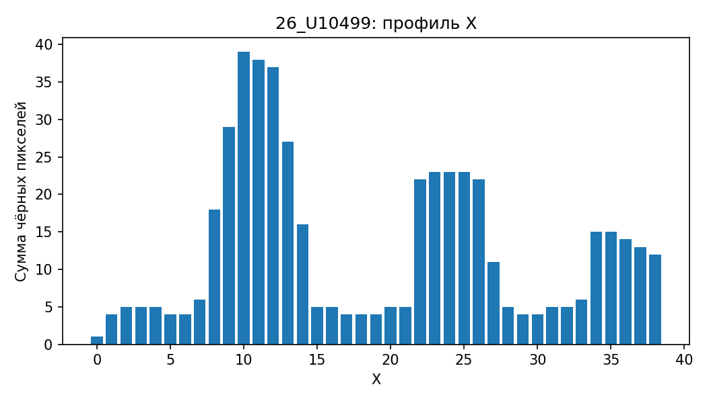

### Профиль Y

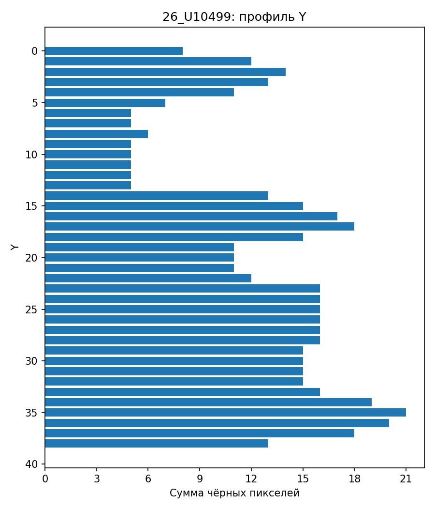

---
## Символ 27 — 𐒚

### Изображение символа

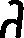

### Скалярные характеристики

| Признак | Значение |
|---|---:|
| Ширина изображения | 24 |
| Высота изображения | 38 |
| Общий вес чёрного | 370 |
| Общий удельный вес | 0.405702 |
| Вес 1-й четверти | 14 |
| Вес 2-й четверти | 120 |
| Вес 3-й четверти | 115 |
| Вес 4-й четверти | 121 |
| Удельный вес 1-й четверти | 0.061404 |
| Удельный вес 2-й четверти | 0.526316 |
| Удельный вес 3-й четверти | 0.504386 |
| Удельный вес 4-й четверти | 0.530702 |
| Координата центра тяжести X | 13.589189 |
| Координата центра тяжести Y | 19.856757 |
| Нормированная координата X | 0.590834 |
| Нормированная координата Y | 0.536669 |
| Осевой момент инерции Ix | 44099.408108 |
| Осевой момент инерции Iy | 17641.556757 |
| Нормированный момент инерции Ix | 0.053020 |
| Нормированный момент инерции Iy | 0.021210 |

### Профиль X

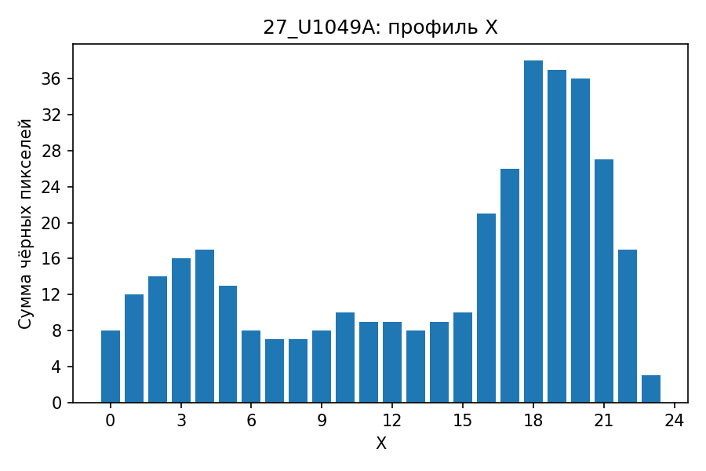

### Профиль Y

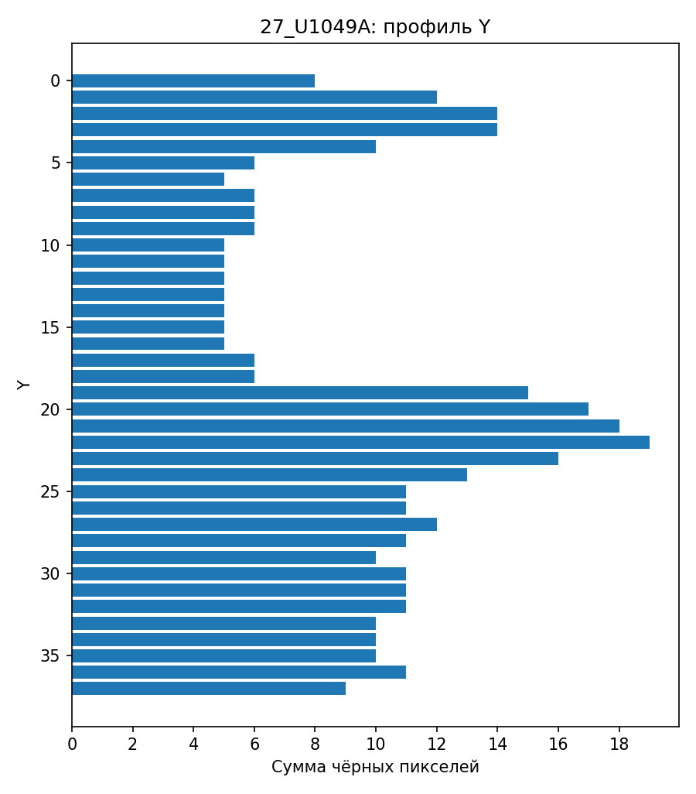

---
## Символ 28 — 𐒛

### Изображение символа

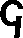

### Скалярные характеристики

| Признак | Значение |
|---|---:|
| Ширина изображения | 23 |
| Высота изображения | 38 |
| Общий вес чёрного | 357 |
| Общий удельный вес | 0.408467 |
| Вес 1-й четверти | 111 |
| Вес 2-й четверти | 79 |
| Вес 3-й четверти | 45 |
| Вес 4-й четверти | 122 |
| Удельный вес 1-й четверти | 0.531100 |
| Удельный вес 2-й четверти | 0.346491 |
| Удельный вес 3-й четверти | 0.215311 |
| Удельный вес 4-й четверти | 0.535088 |
| Координата центра тяжести X | 11.515406 |
| Координата центра тяжести Y | 16.294118 |
| Нормированная координата X | 0.523428 |
| Нормированная координата Y | 0.440382 |
| Осевой момент инерции Ix | 38798.117647 |
| Осевой момент инерции Iy | 15075.165266 |
| Нормированный момент инерции Ix | 0.050791 |
| Нормированный момент инерции Iy | 0.019735 |

### Профиль X

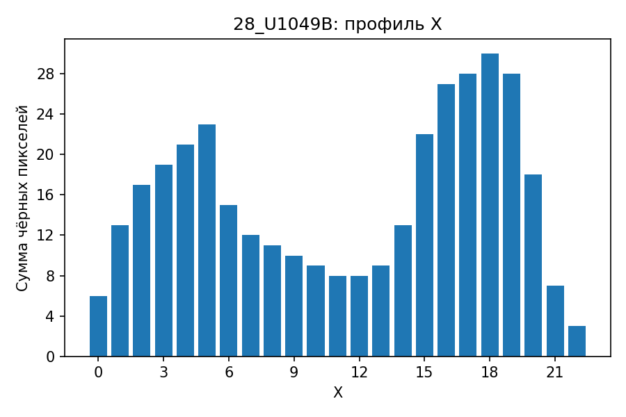

### Профиль Y

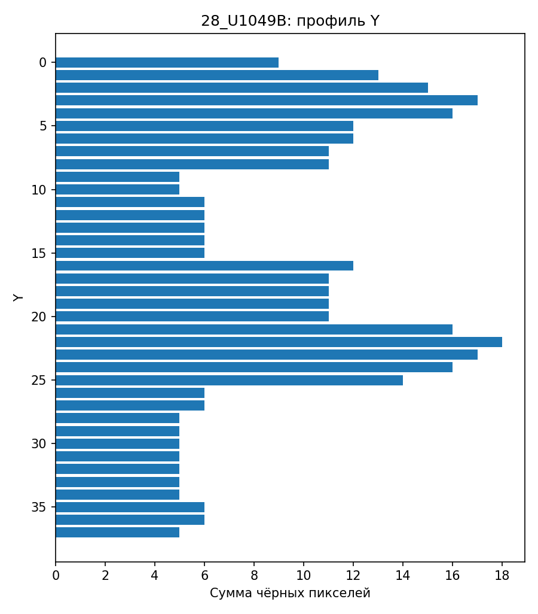

---
## Символ 29 — 𐒜

### Изображение символа

### Скалярные характеристики

| Признак | Значение |
|---|---:|
| Ширина изображения | 33 |
| Высота изображения | 38 |
| Общий вес чёрного | 536 |
| Общий удельный вес | 0.427432 |
| Вес 1-й четверти | 101 |
| Вес 2-й четверти | 97 |
| Вес 3-й четверти | 148 |
| Вес 4-й четверти | 190 |
| Удельный вес 1-й четверти | 0.332237 |
| Удельный вес 2-й четверти | 0.300310 |
| Удельный вес 3-й четверти | 0.486842 |
| Удельный вес 4-й четверти | 0.588235 |
| Координата центра тяжести X | 14.022388 |
| Координата центра тяжести Y | 21.785448 |
| Нормированная координата X | 0.438200 |
| Нормированная координата Y | 0.588796 |
| Осевой момент инерции Ix | 67200.326493 |
| Осевой момент инерции Iy | 49133.731343 |
| Нормированный момент инерции Ix | 0.042734 |
| Нормированный момент инерции Iy | 0.031245 |

### Профиль X

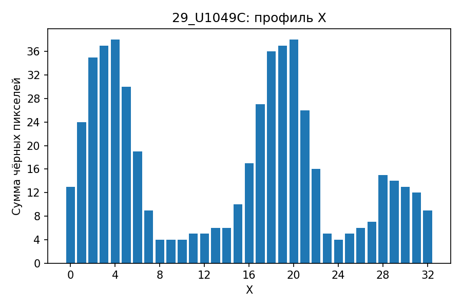

### Профиль Y

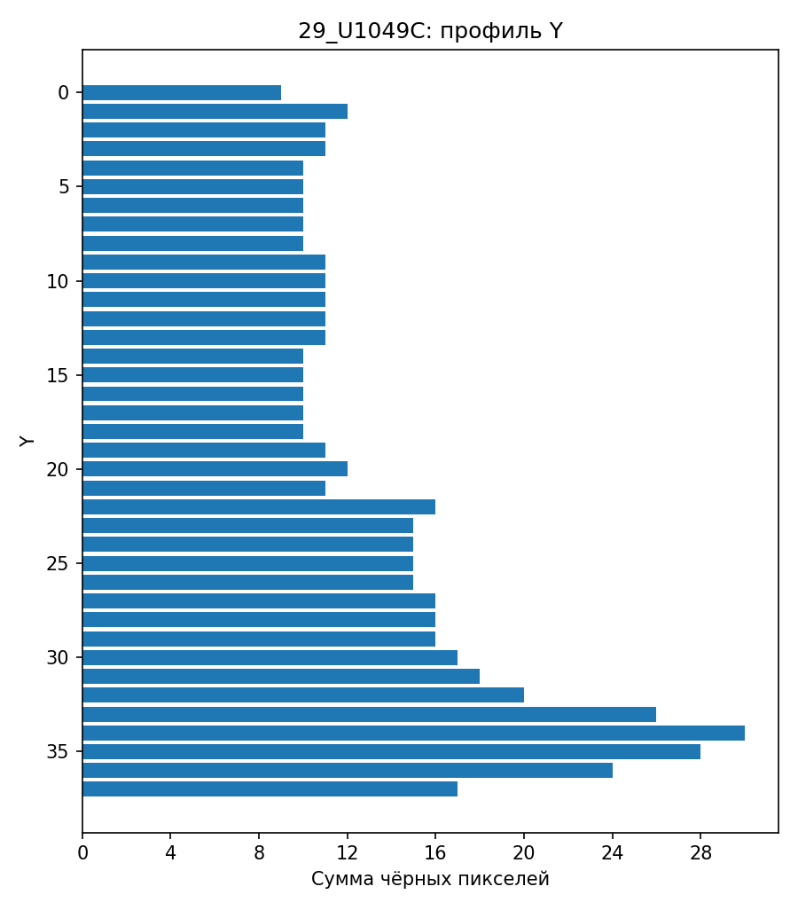

---
## Символ 30 — 𐒝

### Изображение символа

### Скалярные характеристики

| Признак | Значение |
|---|---:|
| Ширина изображения | 51 |
| Высота изображения | 39 |
| Общий вес чёрного | 646 |
| Общий удельный вес | 0.324786 |
| Вес 1-й четверти | 175 |
| Вес 2-й четверти | 45 |
| Вес 3-й четверти | 192 |
| Вес 4-й четверти | 234 |
| Удельный вес 1-й четверти | 0.368421 |
| Удельный вес 2-й четверти | 0.091093 |
| Удельный вес 3-й четверти | 0.384000 |
| Удельный вес 4-й четверти | 0.450000 |
| Координата центра тяжести X | 24.208978 |
| Координата центра тяжести Y | 22.647059 |
| Нормированная координата X | 0.484180 |
| Нормированная координата Y | 0.595975 |
| Осевой момент инерции Ix | 69489.529412 |
| Осевой момент инерции Iy | 115026.787926 |
| Нормированный момент инерции Ix | 0.017565 |
| Нормированный момент инерции Iy | 0.029076 |

### Профиль X

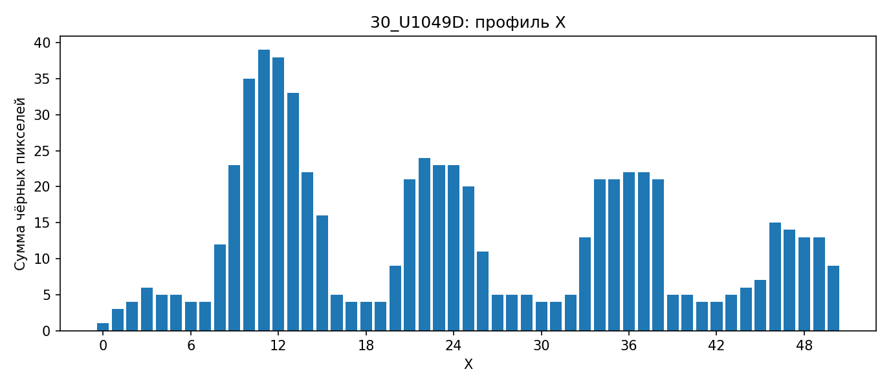

### Профиль Y

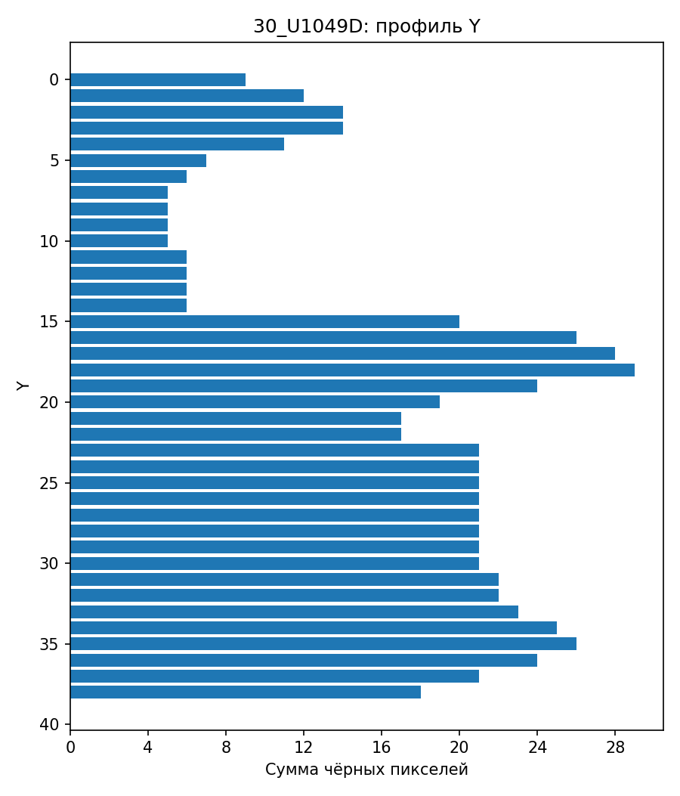

---
