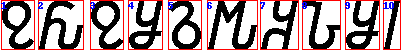
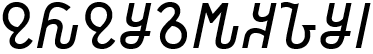
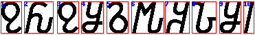

# Лабораторная работа №7. Классификация на основе признаков, анализ профилей

**Вариант:** 8  
**Алфавит:** Османья  
**Исходная строка:** `𐒉𐒅𐒉𐒋𐒈𐒄𐒏𐒊𐒋𐒃`

## Использованные методы

Для каждого неизвестного символа строилось признаковое описание, затем рассчитывалась мера близости со всеми эталонными символами, после чего гипотезы сортировались по убыванию меры близости. Лучшая гипотеза использовалась для построения итоговой распознанной строки.

В качестве признаков использовались нормализованные скалярные характеристики, полученные в предыдущих лабораторных работах:
- удельный вес символа;
- нормированные координаты центра тяжести;
- нормированные осевые моменты инерции по горизонтали и вертикали.

Для сравнения признаковых векторов использовалось **евклидово расстояние** в n-мерном пространстве нормализованных признаков. По полученному расстоянию вычислялась мера близости:

$$S = \frac{1}{1 + d}$$

где \(d\) — евклидово расстояние между векторами признаков.

## Подготовка данных

В качестве эталонов использовались изображения символов алфавита Османья, полученные в лабораторной работе №5.  
В качестве распознаваемой строки использовалось изображение:

`𐒉𐒅𐒉𐒋𐒈𐒄𐒏𐒊𐒋𐒃`

Было проведено два эксперимента:
1. исходное изображение строки, сгенерированное шрифтом **52 кегля**;
2. дополнительное изображение той же строки, сгенерированное шрифтом **60 кегля**.

## Эксперимент 1. Исходный размер шрифта 52

### Исходное изображение

### Сегментация символов

### Гипотезы классификации

1. `𐒍 (0.8501), 𐒉 (0.8157), 𐒛 (0.8045), 𐒒 (0.7880), 𐒕 (0.7752)`  
2. `𐒂 (0.8301), 𐒐 (0.8257), 𐒙 (0.8182), 𐒅 (0.8045), 𐒑 (0.8016)`  
3. `𐒍 (0.8501), 𐒉 (0.8212), 𐒛 (0.8145), 𐒒 (0.7787), 𐒕 (0.7618)`  
4. `𐒈 (0.8612), 𐒑 (0.8373), 𐒒 (0.8287), 𐒋 (0.8198), 𐒔 (0.8160)`  
5. `𐒈 (0.8836), 𐒒 (0.8484), 𐒍 (0.8371), 𐒖 (0.8368), 𐒑 (0.8108)`  
6. `𐒐 (0.8127), 𐒍 (0.8097), 𐒂 (0.8051), 𐒓 (0.7854), 𐒄 (0.7755)`  
7. `𐒂 (0.8735), 𐒍 (0.8254), 𐒖 (0.8079), 𐒚 (0.7655), 𐒊 (0.7382)`  
8. `𐒊 (0.8665), 𐒙 (0.7458), 𐒂 (0.7206), 𐒍 (0.7022), 𐒑 (0.6924)`  
9. `𐒈 (0.8612), 𐒑 (0.8373), 𐒒 (0.8287), 𐒋 (0.8198), 𐒔 (0.8160)`  
10. `𐒊 (0.7171), 𐒖 (0.7098), 𐒍 (0.6551), 𐒈 (0.6396), 𐒒 (0.6343)`

### Результат распознавания

**Эталонная строка:**  
`𐒉𐒅𐒉𐒋𐒈𐒄𐒏𐒊𐒋𐒃`

**Распознанная строка:**  
`𐒍𐒂𐒍𐒈𐒈𐒐𐒂𐒊𐒈𐒊`

**Количество ошибок:** `8`  
**Доля верно распознанных символов:** `20 %`

## Эксперимент 2. Размер шрифта 60

### Исходное изображение

### Сегментация символов

### Гипотезы классификации

1. `𐒍 (0.8584), 𐒉 (0.8151), 𐒛 (0.8047), 𐒒 (0.7909), 𐒕 (0.7725)`  
2. `𐒂 (0.8246), 𐒙 (0.8244), 𐒐 (0.8147), 𐒅 (0.7956), 𐒑 (0.7921)`  
3. `𐒍 (0.8649), 𐒛 (0.8031), 𐒉 (0.7981), 𐒒 (0.7750), 𐒈 (0.7596)`  
4. `𐒈 (0.8617), 𐒒 (0.8379), 𐒑 (0.8294), 𐒋 (0.8291), 𐒔 (0.8289)`  
5. `𐒈 (0.8745), 𐒒 (0.8465), 𐒍 (0.8464), 𐒖 (0.8358), 𐒑 (0.8056)`  
6. `𐒐 (0.8090), 𐒍 (0.8073), 𐒂 (0.7942), 𐒄 (0.7816), 𐒓 (0.7810)`  
7. `𐒂 (0.8638), 𐒍 (0.8119), 𐒖 (0.7950), 𐒚 (0.7483), 𐒊 (0.7453)`  
8. `𐒊 (0.8599), 𐒙 (0.7441), 𐒂 (0.7143), 𐒍 (0.6945), 𐒑 (0.6843)`  
9. `𐒈 (0.8891), 𐒑 (0.8504), 𐒒 (0.8483), 𐒀 (0.8056), 𐒔 (0.8050)`  
10. `𐒊 (0.7079), 𐒖 (0.7029), 𐒍 (0.6543), 𐒈 (0.6433), 𐒒 (0.6409)`

### Результат распознавания

**Эталонная строка:**  
`𐒉𐒅𐒉𐒋𐒈𐒄𐒏𐒊𐒋𐒃`

**Распознанная строка:**  
`𐒍𐒂𐒍𐒈𐒈𐒐𐒂𐒊𐒈𐒊`

**Количество ошибок:** `8`  
**Доля верно распознанных символов:** `20 %`

## Сравнение результатов экспериментов

Поскольку классификация выполнялась по нормализованным признакам, изменение масштаба изображения не должно было сильно влиять на качество распознавания. В проведённом эксперименте это предположение подтвердилось: для кеглей 52 и 60 были получены одинаковые результаты распознавания.

### Сводная таблица результатов

| Эксперимент | Кегль | Распознанная строка | Ошибок | Верно распознано |
|---|---:|---|---:|---:|
| 1 | 52 | `𐒍𐒂𐒍𐒈𐒈𐒐𐒂𐒊𐒈𐒊` | `8` | `20 %` |
| 2 | 60 | `𐒍𐒂𐒍𐒈𐒈𐒐𐒂𐒊𐒈𐒊` | `8` | `20 %` |

## Вывод

В ходе лабораторной работы был реализован алгоритм классификации символов на основе признакового описания. Для каждого символа использовались нормализованные признаки: удельный вес, координаты центра тяжести и осевые моменты инерции. Сравнение с эталонами выполнялось по евклидову расстоянию, после чего для каждого символа формировался упорядоченный список гипотез по убыванию меры близости.

Проведённые эксперименты для двух размеров шрифта показали, что изменение кегля с 52 до 60 не повлияло на итоговый результат распознавания: в обоих случаях было правильно распознано 20 % символов. Это говорит о том, что используемые признаки действительно обладают некоторой устойчивостью к изменению масштаба, однако их набора недостаточно для качественного распознавания символов алфавита Османья. Для повышения точности в дальнейшем можно дополнить классификатор новыми признаками, например профилями, зональными характеристиками или контурными признаками.
