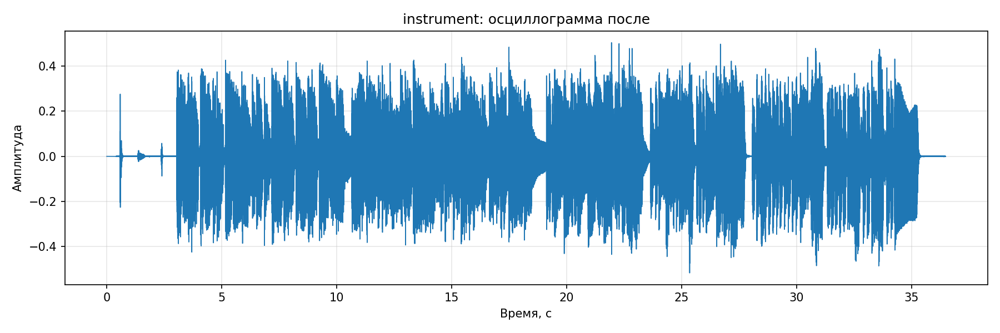
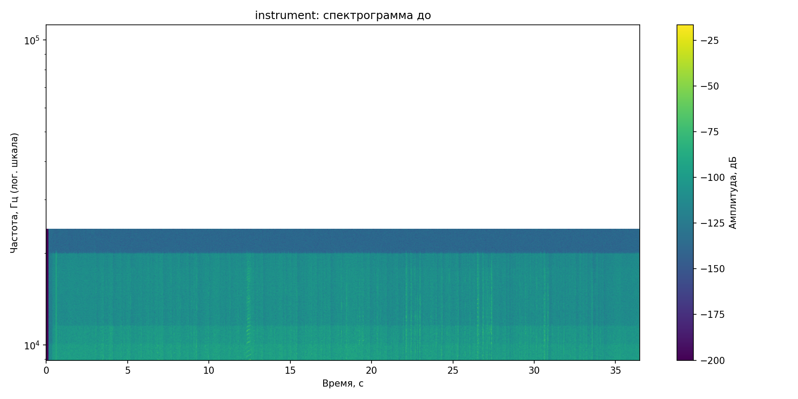
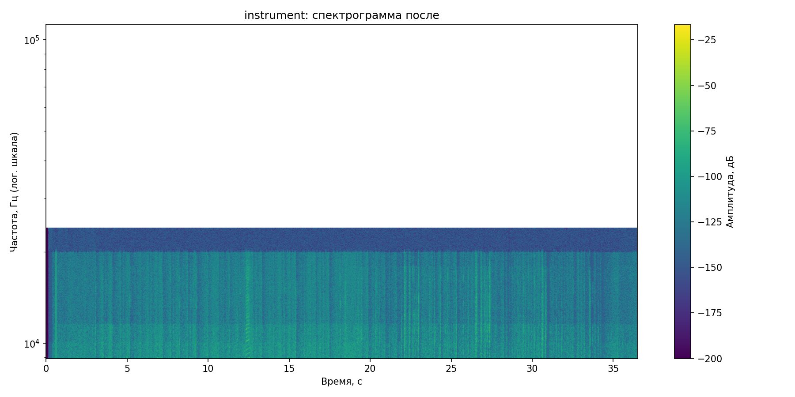

# Лабораторная работа №9. Анализ шума

**Вариант:** 8  

## Цель работы

Исследовать шум в аудиозаписи музыкального инструмента, построить спектрограмму сигнала, оценить уровень шума, выполнить его подавление и определить моменты времени, в которых энергия сигнала максимальна в заданных временных и частотных окрестностях.

## Использованные средства

В работе использовались:
- `Python`
- `numpy`
- `scipy`
- `matplotlib`
- `soundfile` / `scipy.io.wavfile`

## Исходные данные

В качестве исходных данных использовалась аудиозапись музыкального инструмента в формате `wav`.

Параметры записи:
- **файл:** `instrument.wav`
- **частота дискретизации:** `48000 Гц`
- **длительность:** `36.480 с`

Перед обработкой сигнал был приведён к монофоническому виду.

## Использованные методы

### 1. Построение спектрограммы

Для анализа распределения частот во времени использовалось оконное преобразование Фурье (**STFT**).  
В качестве оконной функции применялось **окно Ханна**.

Параметры STFT:
- длина окна: **50 мс**
- перекрытие окон: **75 %**

Спектрограмма отображалась в логарифмической шкале частот.

### 2. Оценка шума

Шум оценивался автоматически по временным окнам с наименьшей энергией.  
Для этого вычислялась энергия каждого временного окна STFT, после чего окна с минимальной энергией использовались для оценки среднего амплитудного спектра шума.

### 3. Подавление шума

Для шумоподавления использовалось **спектральное вычитание**.  
Из амплитудного спектра сигнала вычиталась оценка спектра шума, после чего выполнялось обратное STFT-преобразование для восстановления очищенного сигнала.

Для устранения граничных артефактов при восстановлении сигнала использовались:
- нулевое дополнение сигнала на границах,
- ограничение амплитуды восстановленного сигнала,
- плавное затухание сигнала на конце записи.

### 4. Поиск максимумов энергии

Моменты времени с наибольшей энергией определялись в ячейках временно-частотной сетки с параметрами:
- шаг по времени: $\Delta t = 0.1 \text{ с}$
- шаг по частоте: $\Delta f = 50 \text{ Гц}$

Для каждой временной ячейки выбирался частотный диапазон с максимальной энергией.

---

## Осциллограммы сигнала

### Исходный сигнал

### Сигнал после подавления шума

По осциллограммам видно, что после обработки общая структура сигнала сохранилась. При этом удалось избежать артефактов на конце записи после корректировки параметров восстановления.

---

## Спектрограммы сигнала

### Спектрограмма до обработки

### Спектрограмма после обработки

После подавления шума спектрограмма стала немного чище: общий фоновый уровень в ряде областей уменьшился, особенно в верхней части анализируемого диапазона, при этом основные энергетические компоненты сигнала сохранились.

---

## Оценка уровня шума

В ходе работы были получены следующие результаты:
- **SNR до обработки:** `20.269 dB`
- **SNR после обработки:** `21.466 dB`

После применения спектрального вычитания отношение сигнал/шум увеличилось примерно на **1.2 dB**, что указывает на снижение уровня шума.

Дополнительные данные:
- **число тихих окон:** `438`
- **частота дискретизации:** `48000 Гц`
- **количество отсчётов:** `1751040`
- **длительность:** `36.480 с`
---

## Моменты времени с максимальной энергией

Были найдены временные интервалы и частотные полосы, в которых энергия сигнала максимальна.

### Наиболее энергетически выраженные участки

1. `t = [7.7; 7.8] c`, `f = [400; 450] Гц`, `E = 0.164`
2. `t = [28.5; 28.6] c`, `f = [200; 250] Гц`, `E = 0.162`
3. `t = [33.6; 33.7] c`, `f = [200; 250] Гц`, `E = 0.161`
4. `t = [19.9; 20.0] c`, `f = [200; 250] Гц`, `E = 0.151`
5. `t = [30.8; 30.9] c`, `f = [200; 250] Гц`, `E = 0.142`

Полный список найденных максимумов был сохранён в файл:

`./output/instrument/energy_peaks.csv`

---

## Восстановленный аудиофайл

После подавления шума был сохранён восстановленный аудиосигнал:

`./output/instrument/denoised.wav`
